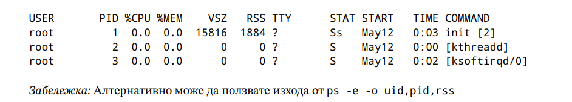

# Notes

- for in bash means "for each work", and if we have filename with spaces for break really easily
- for is not used much to read files, we use while read generally
- when we use cat instead of giving the file input to some commands we get less info since the second command
does not know that it is working with a file
- check commands like sha256sum since they might be really useful for exercises with file content
- sort can be used with multiple columns sort -k 2,2 -k 3,4 -k 1 -> 
this will firstly sort by column 2 then 3 and 4 and then 1
- 


### 2017-se-04
Напишете shell script, който получава задължителен първи позиционен параметър – директория
и незадължителен втори – име на файл. Скриптът трябва да намира в подадената директория и нейните
под-директории всички symlink-ове и да извежда (при подаден аргумент файл – добавяйки към файла,
а ако не е – на стандартния изход) за тях следната информация:

- ако destination-a съществува – името на symlink-а - > името на destination-а;
- броя на symlink-овете, чийто destination не съществува.

Примерен изход:
````text
lbaz -> /foo/bar/baz
lqux -> ../../../qux
lquux -> /foo/quux
Broken symlinks: 34
````


````shell

if [[ "${#}" -lt 1 || "${#}" -gt 2 ]]; then
  echo "The script needs at least one argument (path to directory) and optionally second one (file name)."
  exit 1
fi 

if [[ ! -d  "${1}" ]]; then
  echo "The first argument should be a directory."
  exit 1
fi 

out="/dev/stdout" # by default we work with the standard stdout 

if [[ "${#}" -eq 2 ]]; then
  out="${2}"
fi 

broken=0

while read file; do 
  if [[ -e "${file}" ]]; then
    echo "$(basename ${file}) -> $(readlink "${file}")" >> "${out}"
  else
    broken=$((broken+1))
  fi
done < <(find "${1}" -type l 2>/dev/null) # we add 2>/dev/null to not print the error (it is not required)

echo "Broken symlink count: ${broken}" >> "${out}"

exit 0
````

### 2023-se-01

Напишете скрипт, който цензурира всички срещания на “забранени” думи в дадени текстове.
Примерно извикване: ./redact.sh bad_words.lst ./my_texts .
Първият аргумент на скрипта е име на текстов файл, съдържащ по една забранена дума на ред:
````text
cake
cakes
shake
banana
pine_apple42
shakinator
````
Вторият аргумент е име на директория: интересуват ни всички файлове в нея и в нейните поддиректории,
чиито имена завършват на .txt.

Скриптът ви трябва да подмени всички срещания на забранени думи във въпросните файлове с брой
звездички, съответстващ на дължината на думата. Подменят се само цели срещания на думи.
Например, ако имаме файл . /my_texts/shake.txt със съдържание:

to make banana shake, we start by blending four bananas.

след изпълнение на скрипта, съдържанието му трябва да е:

to make ****** ***** , we start by blending four bananas.

30

Под “дума” разбираме последователност от букви, цифри и долни черти.
За улеснение, може да приемете, че разглеждаме само малки букви (никъде не се срещат главни
букви).
За бонус точки: премахнете улесненито, правейки операцията по цензуриране case-insensitive (файлът
със забранени думи пак съдържа само малки букви, но в текстовете могат да се срещнат варианти на
думите с произволни комбинации от малки и главни букви): ако в примерния текст се срещне думата
BaNaNa, тя трябва да бъде заменена с ****** , защото banana е забранена дума.

This is a simple solution, we can optimise the loops and make it faster. 

````shell
if [[ "${#}" -ne 2 ]]; then
  echo "The script needs two arguments."
  exit 1
fi 

if [[ ! -d  "${2}" ]]; then
  echo "The second argument should be a directory."
  exit 1
fi 
  
# add check for first arg

while read file; do
  while read word; do 
    replace="$(echo "${word} | tr '[a-zA-Z0-9_]' '*'")"
    sed -E -i "s/\b${word}\b/${replace}/gi" "${file}" # \b checks for whitespace, line start and end ; \gi globally and case insensitive 
  done < "${1}"
done < <(find "${2} -type f -name '*.txt' 2>/dev/null")
````

### 2016-se-02

Напишете shell скрипт, който приема един позиционен параметър - число. Ако скриптът
се изпълнява като root, да извежда обобщена информация за общото количество активна памет 
(RSS - resident set size, non-swapped physical memory that a task has used) на процесите на всеки потребител.
Ако за някой потребител обобщеното число надвишава подадения параметър, да изпраща подходящи
сигнали за прекратяване на процеса с най-много активна памет на потребителя.
  
Забележка: Приемаме, че изхода в колоната RSS е число в същата мерна единица, като числото, подадено
като аргумент. Примерен формат:
  


````shell
if [[ "$(whoami)" != "root" ]]; then 
  echo "Not root."
  Exit 1
fi 

for user in $(ps -e user= | sort | uniq); do 
  total_rss="$(ps -u "${user}" -o rss= | awk '{ sum += $1 } END { print sum }')"
  echo "User "${user}" has a total rss of: "${total_rss}" "
  if [[ "${total_rss}" -gt "${1}" ]]; then
    highest_pid="$(ps -u "${user} -o pid= --sort rss | tail -n 1")"
    kill "${highest_pid}"
    sleep 2
    kill -9 "${highest_pid}" # -9 and -KILL are the same -> this can break many things, not generally good to use
done

````