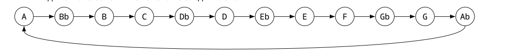
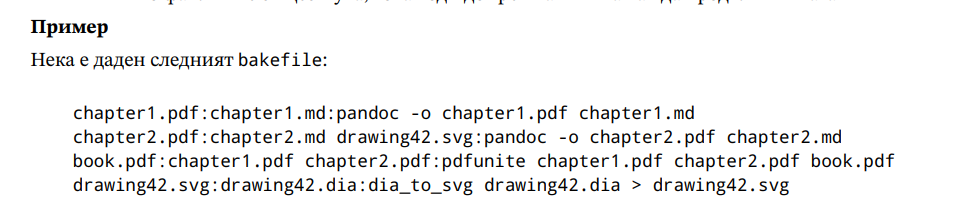

#  Поточна обработка (теми 1,2,3)

### Зад. 1 2016-SE-01

1Даден е текстов файл с име p h i l i p - j - f r y . t x t . Напишете shell script и/или серия от команди,
които извеждат броя редове, съдържащи поне една четна цифра и несъдържащи малка латинска
буква от a до w .

Примерно съдържание на файла:
````text
123abv23
123zz123
MMU_2.4
Примерен изход:
Броят на търсените редове е 2
````

````shell
#!/bin/bash

if [[ "${#}" -ne 1 ]]; then
  echo "The script works with one positional argument - path to the file"
  exit 1
fi 

count="$(cat "${1}" | grep -v [a-w] | grep [2,4,6,8] | wc -l)"

echo "The count of wanted lines is: ${count}"

exit 0
````


### Зад. 2 2017-IN-01
Напишете серия от команди, извеждащи на екрана само броя на всички обекти във файловата
система, чиито собственик е текущият потребител.

Забележка: Във файловата система със сигурност съществуват директории, до които нямате достъп.

````shell
find / -user $(whoami) -print 2>/dev/null | wc -l
# or
find / -uid $(id -u) 2>/dev/null | wc -l
````

### Зад. 3 2017-IN-02 

Напишете серия от команди, които изтриват:

а) всички файлове в текущата директория и нейните поддиректории, които са с нулева дължина.

б) 5-е най-големи файла в home директорията на текущия потребител и нейните поддиректории.

````shell
# a
find . -type f -size 0 | xargs -I {} rm {}
# b
find . -type f -printf "%p|%s\\n" | sort -t "|" -nr -k 2 | head -n 5| awk -F "|" '{print $1}'
````

### Зад. 4 2017-IN-03 

Напишете серия от команди, които от файла /etc/passwd да вземат под-низ, състоящ се
от втора и трета цифра на факултетния номер на студентите от специалност Информатика, чиито
фамилии завършват на “а”. Изведете коя комбинация от цифри се среща най-често и коя е тя.

````shell
# i will write the solution using out course /etc/passwd
cat /etc/passwd | awk -F':' '{print $1 " " $5 }' | awk -F',' '{print $1}' | cut -c3,4 | sort | uniq -c
````

### Зад. 5 2017-SE-01 
Намерете имената на топ 5 файловете в текущата директория с най-много hardlinks.

````shell
ls -l | sort -rk2 -n | head -n 5 | awk '{print $9}'
````

### Зад. 6 2018-SE-01
Променете правата на всички директории, намиращи се някъде във вашата home директория,
така че да станат такива, каквито биха се получили, ако ги бяхте създали с маска 0022 .

````shell
find ~/ -type d | xargs -I {} chmod 755 {} 
````

### Зад. 62 2023-SE-03

При статистическа обработка на текстове често се налага да имаме списък от думи (наречени “стопдуми”), които се срещат прекалено често и не носят стойност за изследването. Такива думи са например
“you”, “then”, “for” и т.н.
Напишете скрипт stopword_candidates.sh , който приема като аргумент име на директория и извежда
10-те думи, които най-много изглеждат като стоп-думи.
- За да бъде стоп-дума, трябва броят файлове, които я съдържат ≥ 3 пъти да е ≥
(общия брой файлове)/2
- Една дума е по-добър кандидат от друга, ако има по-голям общ брой срещания във всички файлове

Забележки:
- Под “всички файлове” имаме предвид всички обикновени файлове в дадената директория и
нейните поддиректории
- Под “дума” имаме предвид непрекъсната последователност от латински букви (a-z) - всички
останали символи не са част от думите
- За улеснение може да приемете, че във файловете няма главни букви

````shell
#!/bin/bash

if [[ "${#}" -ne 1 ]]; then
  echo "The script accepts one positional argument."
  exit 1
fi 

if [[ ! -d "${1}" ]]; then
  echo "The first argument should be a dir"
  exit 1
fi 
file_count=0
temp_dir=$(mktemp -d)

while read file; do
  file_count=$(("${file_count}"+1))
  $( grep -oE '\b[a-zA-Z]+\b' "${file}" | sort | uniq -c | awk '{print $2 " " $1}' >> "${temp_dir}/word_count.txt")
  $( grep -oE '\b[a-zA-Z]+\b' "${file}" | sort | uniq -c | awk '{print $2}' >> "${temp_dir}/file_count.txt" )
done < <(find "${1}" -type f 2>/dev/null)

$(cat file_count.txt | sort | uniq -c >> "${temp_dir}/overall_count.txt" )
$(rm "${temp_dir}/file_count.txt")

limit=$(("${file_count}"/2))
if [[ "${limit}" -lt 3 ]]; then
  limit=3
fi 

$(cat "${temp_dir}/overall_count.txt" | awk -v c="${limit}" '{if ($2 >= c) {print $1}}' >> "${temp_dir}/candidates.txt")
$(rm "${temp_dir}/overall_count.txt")

while read -r word; do
  sum=0
  sum=$(grep "^$word" "${temp_dir}/word_count.txt" | awk -v s="${sum}"'{s += $2} END {print s}')
  $(echo "$word $sum" >> "${temp_dir}/results.txt")
done < candidates.txt

$(rm "${temp_dir}/word_count.txt")
$(rm "${temp_dir}/candidates.txt")

echo "$( cat "${temp_dir}/results.txt" | sort -k2 -nr | head -n 10 )"

$(rm "${temp_dir}/word_count.txt")
$(rmdir "${temp_dir}")

exit 0

````

### 61 2023-SE-02

Задачата ви е да напишете скрипт benchmark.sh , който измерва средното време за изпълнение на
дадена команда. Първият аргумент на скрипта е число (време за провеждане на експеримента, в
секунди), а останалите аргументи на скрипта са измерваната команда и нейните аргументи.
Скриптът трябва да изпълнява подадената команда многократно, докато изтече подаденото време.
Когато това се случи, скриптът трябва да изчака последното извикване на командата да приключи и да
изведе съобщение, описващо броя направени извиквания, общото и средното време за изпълнение.

Забележки:
- Времената се извеждат в секунди, с точност два знака след запетайката.
- Приемете, че времето на изпълнение на частите от скрипта извън подадената команда е пренабрежимо
малко


````shell
#!/bin/bash

if [[ "${#}" -lt 2 ]]; then
  echo "Usage: $0 <duration in seconds> <command> [arguments...]"
  exit 1
fi

duration="${1}"
shift #  literally "shifts" all the positional parameters to the left by one
command="${@}"

end_time=$(( $(date +%s) + duration )) # date +%s за получаване на текущото време,  date +%s.%N за секунди и наносекунди
count=0
total_time=0

while [[ $(date +%s) -lt $end_time ]]; do
  start_time=$(date +%s.%N)
  eval "$command"
  end_time_command=$(date +%s.%N)
  
  runtime=$(echo "$end_time_command - $start_time" | bc) # bc за изчисления с плаваща запетая
  total_time=$(echo "$total_time + $runtime" | bc)
  ((count++))
done

if [[ $count -gt 0 ]]; then
  average_time=$(echo "scale=2; ${total_time} / ${count}" | bc) # scale=2 tells bc to format the result to two decimal places
else
  average_time=0
fi

echo "Ran the command '${command}' ${count} times for a total of $(printf "%.2f" ${total_time}) seconds."
echo "Average runtime: ${average_time} seconds."

exit 0
````

### Зад. 60 2023-SE-01
 See labs/04_05_2024.md


### Зад. 63 2023-SE-04

Напишете скрипт, който открива еднакви по съдържание файлове в дадена директория и използва
тази информация, за да намали заетото място на диска.
Скриптът приема един параметър — име на директория. Примерно извикване: . /dedup.sh ./my-dir
Скриптът трябва да направи две неща:
- ако има файлове с еднакво съдържание, да направи така, че имената на тези файлове да сочат
към едно и също копие на съответните данни
- да изведе съобщение, съдържащо следната информация:
    - колко групи файлове са дедупликирани
    - колко байта от мястото на диска се е освободило
Забележки:
- считаме, че цялата дадена директория се намира върху една файлова система
- ако два файла имат еднакви хеш-суми, считаме, че са еднакви по съдържание

````shell
#!/bin/bash

if [ "$#" -ne 1 ]; then
  echo "Usage: $0 <directory>"
  exit 1
fi

if [ ! -d "$1" ]; then
  echo "The provided argument is not a directory."
  exit 1
fi

directory="$1"
temp_file=$(mktemp)

find "$directory" -type f | while read file; do
  sha256sum "$file" >> "$temp_file"
done

sort "$temp_file" -o "$temp_file" # -o overwrite the existing content 

prev_hash=""
prev_file=""
total_saved=0
dedup_groups=0

while read hash file; do
  if [ "$hash" == "$prev_hash" ]; then
    if [ -n "$prev_file" ]; then # -n the length of the string is non-zero
      filesize=$(stat -c %s "$file")
      rm "$file" && ln "$prev_file" "$file" # remove duplicate and link it to the original
      total_saved=$((total_saved + filesize))
    fi
  else
    prev_file="$file"
    dedup_groups=$((${dedup_groups}+1))
  fi
  prev_hash="${hash}"
done < "$temp_file"

echo "Number of deduplicated groups: $dedup_groups"
echo "Total disk space saved: $total_saved bytes"

rm "$temp_file"
exit 0
````

### Зад. 64 2023-SE-05
Казваме, че командата foo заема памет 𝑋, когато 𝑋 е сумата на заетата физическа памет (rss) на
всички процеси, чиято команда (comm) е foo.
Напишете скрипт, който поглежда процесите на системата през една секунда, докато спрат да съществуват
команди, чиято заета памет е над 65536.
След това, скриптът трябва да изведе всички команди, които са заемали памет над 65536 в поне половината
“поглеждания”

````shell
````


### Зад. 65 2023-SE-06
Напишете скрипт, който копира снимки от дадена директория (която ще наричаме фотоапарата) в
нова директория (която ще наричаме библиотеката), спазвайки определена структура.
Скриптът приема пътищата на двете директории като аргументи, очаквайки, че библиотеката не
съществува и трябва да я създаде.
Снимките са всички файлове в директорията на фотоапарата и нейните поддиректории, чиито
имена завършват на .jpg. Под дата на снимка ще имаме предвид нейното време на модификация
(mtime).
Библиотеката трябва да се състои от поддиректории с имена от вида 2023-04-20_2023-04-23, означаващи
затворени интервали от дни. Скриптът трябва да създаде такива поддиректории и да разположи
снимките в тях, така че да са изпълнени следните свойства:
1. Всяка снимка се намира в такава директория, че датата на снимката да принадлежи на съответния
   интервал от дни
2. За всеки ден от всеки интервал съществува поне една снимка от този ден в този интервал
3. Няма припокриващи се и долепени интервали (между всеки два различни интервала има поне
   един ден без снимка)
   Оригиналните имена на снимките не ни интересуват: скриптът трябва да им даде нови имена, използвайки
   техния mtime, с формат, изглеждащ така:
  

   Бонус за още няколко точки: направете скрипта така, че да може да работи при вече съществуваща
   библиотека, добавяйки снимките от фотоапарата към нея и запазвайки всички 

````shell
#!/bin/bash
if [ "$#" -ne 2 ]; then
  echo "Usage: $0 <source directory> <target directory>"
  exit 1
fi

source_dir=$1
target_dir=$2

mkdir -p "$target_dir"

find "${source_dir}" -type f -name '*.jpg' | while read file; do
  mod_date=$(date -r "$file" '+%Y-%m-%d')
  mod_time=$(date -r "$file" '+%H:%M:%S')
  year=$(echo "$mod_date" | cut -d '-' -f1)
  month=$(echo "$mod_date" | cut -d '-' -f2)
  day=$(echo "$mod_date" | cut -d '-' -f3)

  date_dir="${year}-${month}-${day}"

  mkdir -p "$target_dir/$date_dir"

  new_filename="${mod_date}_${mod_time}.jpg"

  cp "$file" "$target_dir/$date_dir/$new_filename"
done

exit 0
````


### Зад. 54 2021-SE-01
Разполагате с машина, на която е инсталиран специализиран софтуер, който ползва два потребителски
акаунта – oracle и grid . Всеки от потребителите би трябвало да има environment променлива ORACLE_HOME,
която указва абсолютен път до директория във формат /path/to/dir. В под-директория bin на зададената
директория би трябвало да има изпълним файл с име adrci . Всеки от двата потребителя има собствена
директория diag_dest, която е във вида /u01/app/потребител. Когато някой от потребителите изпълни
неговото копие на командата adrci с параметър exec="show homes" може да получи на STDOUT един
от следните два изхода:
- вариант 1: (неуспех): No ADR homes are set
- вариант 2: (успех):


И в двата случая командата приключва с exit code 0 . Ако командата се изпълни успешно, тя връща
списък с един или повече ADR Homes, които са релативни имена на директории спрямо diag_dest на
съответният потребител.
Напишете скрипт, който може да се изпълнява само от някой от тези два акаунта, и извежда на STDOUT размера в мегабайти и абсолютният път на всеки ADR Home.

- Примерен изход:


````shell
#!/bin/bash

# the solution will work only for oracle

if [[ "$(whoami)" != "oracle" ]]; then
  echo "This script must be run by 'oracle' user."
  exit 1
fi

ORACLE_HOME=$(echo $ORACLE_HOME)
diag_dest="/u01/app/$(whoami)"

output=$(ORACLE_HOME/bin/adrci exec="show homes")

if [[ $output =~ "No ADR homes are set" ]]; then
  echo "No ADR homes are set"
  exit 0
fi

echo "$output" | grep -v 'ADR Homes' | while read -r line; do # -r prevent treating a backslash (\) as an escape char
  full_path="$diag_dest/$line"
  size_mb=$(du -sm "$full_path" | cut -f1) # -s summarize, -m megabytes
  echo "$size_mb $full_path"
done

exit 0
````

### Зад. 46 2021-SE-03 

Напишете shell скрипт, който приема два позиционни параметъра – имена на файлове.
Примерно извикване:

$ ./foo.sh input.bin output.h

Файлът input.bin е двоичен файл с елементи uint16_t числа, създаден на little-endian машина.
Вашият скрипт трябва да генерира C хедър файл, дефиниращ масив с име arr, който:
- съдържа всички елементи от входния файл;
- няма указана големина;
- не позволява промяна на данните.
Генерираният хедър файл трябва да:
- съдържа и uint32_t променлива arrN, която указва големината на масива;
- бъде валиден и да може да се #include-ва без проблеми от C файлове, очакващи да “виждат”
arr и arrN.

За да е валиден един входен файл, той трябва да съдържа не повече от 524288 елемента.
За справка, dump на съдържанието на примерен input.bin:
00000000: 5555 5655 5955 5a55 6555 6655 6955 6a55 UUVUYUZUeUfUiUjU
00000010: 9555 9655 9955 9a55 a555 a655 a955 aa55 .U.U.U.U.U.U.U.U

````shell
#!/bin/bash

if [ $# -ne 2 ]; then
    echo "Usage: $0 input.bin output.h"
    exit 1
fi

input_file=$1
output_file=$2

if [ $(stat -c %s "$input_file") -gt $((524288 * 2)) ]; then # 524288 * 2 bites
    echo "Error: input file is too large."
    exit 1
fi

# Use xxd to dump the binary data in plain hexadecimal format, with 2 bytes per chunk.
numbers= xxd -p -c 2 example-soa | awk '{print "0x"$1","}'
num_elements=$(echo "$numbers" | wc -l)


echo "const uint16_t arr[${num_elements}] = {" > "$output_file"
echo "$numbers" >> "$output_file"
echo "};" >> "$output_file"

exit 0
````

### Зад. 45 2021-SE-02

Един от често използваните DNS сървъри е BIND9, при който описанието на DNS зоните обикновенно
стои в текстови файлове, наричани зонални файлове. За улеснение, в рамките на задачата, ще ползваме
опростено описание на зоналните файлове.
Под whitespace разбираме произволна комбинация от табове и интервали.
Под FQDN разбираме низ, който има допустими символи малки латински букви, цифри и точка; не
може да започва с точка, не може да има две или повече съседни точки, задължително завършва с
точка.

Зоналните файлове съдържат ресурсни записи, по един на ред. Общият вид на даден ресурсен запис e
<ключ> <TTL> <клас> <тип> <RDATA>, разделени с whitespace, например:

astero.openfmi.net. 3600 IN A 185.117.82.99

Където:
- ключ (astero.openfmi.net.) – FQDN
- TTL (3600) – цифри; полето може да липсва
- клас (IN) - главни латински букви; класът винаги е IN
- тип (A) - главни латински букви; някое от SOA, NS, A, AAAA
- RDATA (185.117.82.99) - данни на записа; различни за различните типове ресурсни записи;
всичко след типа до края на реда.

Знакът точка-и-запетая ; е знак за коментар, и всичко след него до края на реда се игнорира.
Във всеки зонален файл трябва да има точно един SOA запис, и той трябва да е първият запис във
файла. Пример за едноредов SOA запис:

astero.openfmi.net. 3600 IN SOA nimbus.fccf.net .root.fccf.net. 2021041901 86400 7200 3024000 3600
    
RDATA-та на SOA запис се състои от два FQDN-а и пет числа, разделени с whitespace.
Въпреки, че горното е валиден SOA запис, за прегледност в зоналните файлове често се ползва следният
синтаксис (многоредов SOA запис, еквивалентен на горния):

astero.openfmi.net. 3600 IN SOA nimbus.fccf.net .root.fccf.net. (
                                2021041901 ; serial
                                86400      ; refresh
                                7200       ; retry
                                3024000    ; expire
                                3600       ; negative TTL
                                )

т.е., поредицата от числа се разбива на няколко реда, оградени в обикновенни скоби, и за всяко число
се слага коментар какво означава.
Първото от тези числа (
) представлява серийният номер на зоната, който трябва да се увеличава
всеки път, когато нещо в зоналният файл се промени. Изключително важно е това число само да
нараства, и никога да не намалява.
Един от често използваните формати за сериен номер, който показва кога е настъпила последната
промяна в зоналния файл представлява число във вида YYYYMMDDTT, т.е., четири цифри за година,
две цифри за месец, две цифри за дата и още две цифри за поредна промяна в рамките на описания
ден. За последните две цифри (ТТ) има ограничение да са от 00 до 99 (естествено, така не може да има
повече от 100 промени в рамките на един ден).
За удобство приемаме, че конкретен сериен номер (точната поредица цифри) се среща само на едно
място в зоналния файл.
Напишете шел скрипт, който по подадени имена на зонални файлове променя серийният номер в
SOA записа на всеки файл по следният алгоритъм:
- ако датата в серийният номер е по-стара от днешната, новият сериен номер трябва да е от вида
днешнадата00
- ако датата в серийният номер е равна на днешната, серийният номер трябва да се увеличи с
единица

Важат следните условия:
- скриптът трябва да може да обработва и едноредови, и многоредови SOA записи
- за всеки зонален файл, който не е успял да обработи, скриптът трябва да вади съобщение за
  грешка, което включва и името на зоналния файл. Съобщенията трябва да са лесно обработваеми
  с познатите инструменти за обработка на текст

````shell
#!/bin/bash

if [[ $# -eq 0 ]]; then
   echo "Usage: $0 zonefile1 [zonefile2 ...]"
   exit 1
fi

today=$(date +%Y%m%d) 

for file in "$@"; do
    if [[ ! -f "$file" ]];then
      echo "ERROR: File $file not found."
      continue
    fi
      
     current_serial=$(grep "; serial" ${file} | awk -F" " '{print $1}' && cat ${file} | grep -vE "(\|;\|)" | awk -F" " '{print $7}')

    if [[ -z "$current_serial" ]]; then
        echo "ERROR: No valid SOA serial number found in $file."
        continue
    fi

    current_date=${current_serial:0:8} # ${variable:start:length} -> extract a substring from $variable.
    revision=${current_serial:8:2}  

    if [ "$current_date" -lt "$today" ]; then
        new_serial="${today}00"
    elif [ "$current_date" -eq "$today" ]; then
        new_revision=$(printf "%02d" $((10#$revision + 1))) # %02 to pad with 0 ;#10 interpret as decimal -> by default bash works with octal
        new_serial="${today}${new_revision}"
    else
        echo "ERROR: SOA serial date is in the future in $file."
        continue
    fi

    sed -i "s/$current_serial/$new_serial/" "$file"
    echo "INFO: Updated SOA serial number in $file to $new_serial."
done

````
### 2022-SE-01

 Съвременните компютри могат да влизат в различни режими за енергоспестяване (suspend) и излизат от този режим (wake-up) при настъпването на определени събития. Linux kernel предоставя
специален виртуален файл /proc/acpi/wakeup, чрез който може да се проверява или променя настройката
за “събуждане” при настъпване на различни събития, в общия случай - при активност на някое устройство.
Тъй като този файл е интерфейс към ядрото, “четенето” от файла и “писането” във файла изглеждат
различно.
За улеснение на задачата ще ползваме опростено описание на този файл.
Под whitespace разбираме произволна комбинация от табове и интервали. При четене от файла изходът
представлява четири колони, разделени с whitespace, в полетата не може да има whitespace; първият
ред е header на съответната колона. Примерно съдържание на файла:
````text
Device S-state Status       Sysfs n ode
GLAN   S4      *enabled     pci:0000:00:1f.6
XHC    S3      *enabled     pci:0000:00:14.0
XDCI   S4      *disabled
LID    S4      *enabled     platform:PNP0C0D:00
HDAS   S4      *disabled    pci:0000:00:1f.3
RP01   S4      *enabled     pci:0000:00:1c.0
````
където:
- първата колона дава уникално име на устройство, което може да събуди машината, като името
е ограничено до четири знака главни латински букви и цифри;
- третата колона описва дали това устройство може да събуди машината. Възможните стойности
са enabled/disabled, предхождани от звездичка;
- втората и четвъртата колона ги игнорираме в рамките на задачата.

При записване на име на устройство във файла /proc/acpi/wakeup, неговото състояние се променя
от disabled на enabled или обратно. Например, ако файлът изглежда както примера по-горе, при
запис на XHC в него, третият ред ще се промени на:

  XHC    S3      *disabled     pci:0000:00:14.0

При запис на HDAS , шестият ред ще се промени на:

  HDAS   S4      *disabled    pci:0000:00:1f.3

Дефиниран е формат на конфигурационен файл, който описва желан комплект от настройки на wakeup събития. Примерен файл:
````text
# comment bar
GLAN disabled
LID enabled # comment foo
````
където:
- знакът диез (# ) е знак за коментар до края на реда;
- редовете би трябвало да са комбинация от име на устройство и желаното състояние на настройката
за събуждане при събития от това устройство, разделени с whitespace.

Напишете скрипт, който при подаден първи параметър име на конфигурационен файл в горния формат
осигурява исканите настройки за събуждане. Ако във файла има ред за устройство, което не съществува,
скриптът да извежда предупреждение. Обърнете внимание на обработката за грешки и съобщенията
към потребителя – искаме скриптът да бъде удобен и валиден инструмент.

````shell
#!/bin/bash

CONFIG_FILE="$1"

if [[ "$#" -ne 1 ]] || [[ ! -f "$CONFIG_FILE" ]]; then
    echo "Usage: $0 <config_file>"
    exit 1
fi

current_settings=$(cat /proc/acpi/wakeup)

while read -r line; do
  
    line=$(echo "$line" | sed 's/#.*//')
    
    if [[ -z "$line" ]]; then
        continue
    fi

    device_name=$(echo "$line" | awk '{print $1}')
    desired_status=$(echo "$line" | awk '{print $2}')

    if echo "$current_settings" | grep -q "^$device_name"; then
        if [[ "$desired_status" == "enabled" ]]; then
              current_settings=$(echo "$current_settings" | sed "/^$device_name[[:space:]]/s/\*disabled/\*enabled/")
        elif [[ "$desired_status" == "disabled" ]]; then
            current_settings=$(echo "$current_settings" | sed "/^$device_name[[:space:]]/s/\*enabled/\*disabled/")
        fi
    else
        echo "WARN: Device '$device_name' does not exist in /proc/acpi/wakeup!"
    fi
done < "$CONFIG_FILE"

echo "$current_settings" > /proc/acpi/wakeup
exit 0
````
### 2022-SE-02
 Дефинирана е система за бекъпване на сървъри, която държи направените архиви в
главна директория (която ще наричаме fubar), в която има четири под-директории за различни класове
бекъпи:
- 0 – съдържа годишни бекъпи
- 1 – съдържа месечни бекъпи
- 2 – съдържа седмични бекъпи
- 3 – съдържа дневни бекъпи

Всяка директория съдържа архивни файлове с имена във формат hostname-area-YYYYMMDD.tar.xz,
където:
- hostname името на някаква машина, която е бекъпвана;
- area е типът бекъп за съответната машина;
- YYYYMMDD е датата, на която е направен бекъпа;
- никое от горните полета не може да съдържа тире или точка;
- някои от файловете могат да са symlink-ове.

Примерни имена на файлове:
````text
astero-etc-20220323.tar.xz stratios-etc-20220428.tar.xz  nestor-db-20220404.tar.xz 
gila-srv-20220405.tar.xz  catalyst-var-20220406.tar.xz  drake-home-20220404.tar.xz 
dominix-var-20220404.tar.xz 
````

Комбинацията от hostname и area дефинира уникален обект за бекъпване. Всички архивни файлове
са пълноценни бекъпи на даден обект и са достатъчни за неговото възстановяване при нужда (заб.
извън обхвата на задачата).
Ако даден файл е symlink, то той може да е валиден или счупен. Symlink-овете са създадени за удобство
и не ги считаме за пълноценни бекъпи.
Политиката ни за бекъп казва, че за да имаме валиден бекъп на даден обект, за него трябва да имаме
минимум 1 годишен, 2 месечни, 3 седмични и 4 дневни пълноценни бекъпа.

Важност:
- обектите са равни по важност помежду си;
- важността на класовете бекъпи е във възходящ ред по горния списък, т.е. при равни други
условия дневните бекъпи са по-ценни от седмичните и т.н.;
- в рамките на един клас бекъпи по-новите бекъпи са по-важни от по-старите.

Напишете shell скрипт, който приема два два задължителни позиционни аргумента – име на директория
и число в интервала [1, 99]. Примерно извикване: ./foo.sh ./bar/ 30 където:
- директорията представлява главна директория (fubar) на описаната система за бекпъване;
- числото дефинира колко процента е максималното допустимо използвано място на файловата
система, в която се намира подадената директория.

За удобство приемаме, че директорията fubar и всички обекти в нея се намират в една и съща файлова
система.
Упътване: Командата df извикана с аргумент име на файл/директория връща информация за файловата
система, в която той се намира. 
Пример:
````shell
$df ./README.md
````
````text
Filesystem          1K-blocks   Used        Available   Use%    Mounted on
/dev/mapper/o7-hm   100663296   61735732    37288764    63%     /home
````

Скриптът трябва да изтрива минимален брой пълноценни архивни файлове така, че:
- всеки обект да има валиден бекъп;
- обръща внимание на описаните по-горе важности;
- процентите използвано място върху файловата система да е не повече от подаденият параметър
(a ако това е невъзможно, скриптът да освободи колкото може повече място, без да нарушава
валидностите на бекъпите на обектите);
- не е допустимо след работата на скрипта да останат счупени symlink–ове.

````shell
#!/bin/bash

if [[ "$#" -ne 2 ]]; then
    echo "Usage: $0 <directory> <max_percent>"
    exit 1
fi

backup_dir=$1
max_percent=$2

if [[ ! -d "$backup_dir" ]]; then
    echo "Error: Directory $backup_dir does not exist."
    exit 1
fi

current_usage=$(df "$backup_dir" | awk 'NR==2 {print $5}' | sed 's/%//')

if [[ "$current_usage" -le "$max_percent" ]]; then
    echo "Current usage ($current_usage%) is within the limit ($max_percent%). No action needed."
    exit 0
fi

find -L "$backup_dir" -type l -delete

backup_files=$(find "$backup_dir" -type f -name "*.tar.xz" | awk -F '[/-]' '{print $(NF-1) " " $0}' | sort -k1,1n | awk '{print $2}')

for file in $backup_files; do
    filename=$(basename "$file")
    hostname=$(echo "$filename" | cut -d'-' -f1)
    area=$(echo "$filename" | cut -d'-' -f2)

    min_yearly=1
    min_monthly=2
    min_weekly=3
    min_daily=4

    yearly_count=$(find "$backup_dir/0" -type f -name "$hostname-$area-*.tar.xz" | wc -l)
    monthly_count=$(find "$backup_dir/1" -type f -name "$hostname-$area-*.tar.xz" | wc -l)
    weekly_count=$(find "$backup_dir/2" -type f -name "$hostname-$area-*.tar.xz" | wc -l)
    daily_count=$(find "$backup_dir/3" -type f -name "$hostname-$area-*.tar.xz" | wc -l)

    if [[ "$yearly_count" -ge "$min_yearly" && "$monthly_count" -ge "$min_monthly" && "$weekly_count" -ge "$min_weekly" && "$daily_count" -ge "$min_daily" ]]; then
        rm -f "$file"
        echo "Removed $file to free up space."

        current_usage=$(df "$backup_dir" | awk 'NR==2 {print $5}' | sed 's/%//')
        if [ "$current_usage" -le "$max_percent" ]; then
            break
        fi
    fi
done

exit 0
````


### Зад. 69 2024-SE-02

Ваши колеги използват система за съхранение на файлове PrevCloud, която има собствена система
за потребители, различна от тази за локални потребители на операционната система (/etc/passwd).
Колегите ви са ви дали на готово компилирана програма occ, с която се управляват потребителите на
PrevCloud, и ви молят да напишете скрипт sync-users.sh, който обновява потребителите на PrevCloud
спрямо локалните потребители.
Ще разграничаваме:
- Потребители на PrevCloud, до които имаме достъп чрез occ
- Локални потребители - потребители на операционната система с UID ≥ 1000
- Системни потребители - потребители на операционната система с UID < 1000 (те не се използват в задачата)


Документация на подкомандите на occ, предоставена от вашите колеги:
- ./occ user:list – дава списък от PrevCloud потребители във вида - USERNAME: DISPLAYNAME,
като в задачата се интересуваме единствено от USERNAME. Примерен изход:
  - rms: Richard Stallman
  - dennis: Dennis Ritchie
  - brian: Brian Kernighan
- ./occ user:info USERNAME – дава информация за PrevCloud потребителя USERNAME. Примерен изход:
  - user_id: rms
  - display_name: Richard Stallman
  - email: rms@gnu.org
  - enabled: true
  - quota: none
- ./occ user:add USERNAME – създава нов PrevCloud потребител с име USERNAME; няма ефект и
  завършва неуспешно, ако той вече съществува
- ./occ user:disable USERNAME – заключва профила на PrevCloud потребителя USERNAME (това съответства на полето enabled в изхода на user:info); няма ефект и завършва неуспешно,
  ако той вече е заключен
- ./occ user:enable USERNAME – отключва профила на PrevCloud потребителя USERNAME (това
  съответства на полето enabled в изхода на user:info); няма ефект и завършва неуспешно, ако
  той вече е отключен


Вашата задача:
Скриптът sync-users.sh трябва:
- Ако за даден локален потребител няма съответен PrevCloud потребител със същия USERNAME, да създаде PrevCloud потребител за него.
- Ако за даден локален потребител съществува PrevCloud потребител, но той е заключен, да отключи съответния PrevCloud потребител.
- Ако за даден PrevCloud потребител не съществува локален потребител, да заключи съответния PrevCloud потребител.
  
Забележки за поведението на скрипта:
- С цел по-лесно тестване, ако съществува environment променливата PASSWD, нека скриптът използва файла, чието име е посочено в нея, вместо /etc/passwd, за да вземе локалните потребители.
- Пълен брой точки ще получат решения, в които occ командите за добавяне, заключване и отключване на потребител не се извикват излишно (напр. не се извиква ./occ user:enable за PrevCloud потребител, който не е заключен).
- Програмата occ се намира в същата директория като скрипта sync-users.sh. Подсигурете скриптът sync-users.sh да може да бъде изпълняван от произволна текуща директория.


````shell
#!/bin/bash

PASSWD_FILE="${PASSWD:-/etc/passwd}"

OCC_DIR="$(dirname "$0")"
OCC="$OCC_DIR/occ"

local_users=$(awk -F: '$3 >= 1000 {print $1}' "$PASSWD_FILE") # for username:x:1000:1000:User Name:/home/username:/bin/bash

prevcloud_users=$($OCC user:list | awk -F: '{print $1}')

for user in $local_users; do
    if echo "$prevcloud_users" | grep -q "^$user$"; then
        is_enabled=$($OCC user:info "$user" | grep -E '^ *enabled: ' | awk '{print $2}')
        if [ "$is_enabled" = "false" ]; then
            echo "Отключване на потребител $user в PrevCloud."
            $OCC user:enable "$user"
        fi
    else
        echo "Създаване на нов потребител $user в PrevCloud."
        $OCC user:add "$user"
    fi
done

# PrevCloud, които не са локални потребители
for user in $prevcloud_users; do
    if ! echo "$local_users" | grep -q "^$user$"; then
        is_enabled=$($OCC user:info "$user" | grep -E '^ *enabled: ' | awk '{print $2}')
        if [ "$is_enabled" = "true" ]; then
            echo "Заключване на потребител $user в PrevCloud."
            $OCC user:disable "$user"
        fi
    fi
done

exit 0
````

### Зад. 70 2024-SE-03

ChordPro е текстов формат за представяне на текстове на песни, анотирани с акорди. Примерен откъс:
````text
For [Fmaj7]here am I [Em]sitting in a tin can
[Fmaj7]Far above the [Em]world
[Bb]Planet Earth is [Am]blue and there's [G]nothing I can [F]do
````
Всяка поредица от символи, оградена в квадратни скоби, ще наричаме акорд. Първите един или два
символа на акорда наричаме основен тон.
Напишете скрипт transpose.sh, който приема един аргумент (неотрицателно число 𝑁). Скриптът
трябва да чете текст във формàта ChordPro от stdin и да изписва аналогичен текст на stdout, 
заменяйки единствено основните тонове по следната схема:


Числото 𝑁 задава брой преходи по ребрата за замяна. Например, при изпълнение на скрипта с 𝑁 = 3
върху горния пример, резултатът би бил:
````text
For [Abmaj7]here am I [Gm]sitting in a tin can
[Abmaj7]Far above the [Gm]world
[Db]Planet Earth is [Cm]blue and there's [Bb]nothing I can [Ab] do
````
Забележки:
- Моля, избягвайте повторение на код.
- Ако свирите на тромпет, използвайте 𝑁=3. За валдхорна, използвайте 𝑁=8

````shell
#!/bin/bash

if [[ $# -ne 1 ]]; then
    echo "Usage: $0 N"
    exit 1
fi

N=$1

tones="A Bb B C Db D Eb E F Gb G Ab"
tone_count=12

while IFS= read -r line; do
    echo "$line" | sed -E "s/\[([A-G][b#]?)([a-z0-9]*)\]/$(
        echo "$line" | sed -E 's/\[([A-G][b#]?)([a-z0-9]*)\]/\1/g' | # \1 препратка към първата група за съвпадение в  регулярния израз
        while read -r base_note; do
            position=$(echo "$tones" | tr ' ' '\n' | grep -nx "$base_note" | cut -d':' -f1)
            new_position=$(( (position - 1 + N) % tone_count + 1 ))
            new_base_note=$(echo "$tones" | cut -d' ' -f$new_position)
            echo "$new_base_note"
        done
    )\2/g" # \2 препратка към втората група за съвпадение в регулярния израз
done
````

### Зад. 71 2024-SE-04
Напишете скрипт bake.sh, който приема един задължителен аргумент - име на файл.
Скриптът трябва да реализира build система, която изгражда дадения файл по следния алгоритъм.

#### Правила за изграждане на файлове
Скриптът се управлява от файл с име bakefile, който би трябвало да съществува в текущата директория,
от която извикваме bake.sh. Файлът bakefile описва правила, по които се изграждат различните файлове,
които bake.sh може да изгражда. Всеки ред дефинира правило за някой файл във вида:

<файл>:<зависимост1> <зависимост2> ... <зависимостN>:<команда>


Където:
- <файл> : името на файла, за който се отнася този ред
- <зависимост...> : имена на файлове, които трябва да бъдат изградени преди да може да се
изгради файлът <файл>. Може да приемете, че зависимостите няма да образуват цикъл.
- <команда> : произволна команда, която изгражда файла. Може да приемете, че след извикването
на тази команда, ще е бил създаден файл с име <файл>.

#### Алгоритъм за изграждане на файл
- Ако за файла има запис в bakefile:
1. Изграждаме всички негови зависимости по същия алгоритъм
2. Изпълняваме изграждащата команда, но само ако ако някоя от зависимостите е по-нова от самия файл
- Ако за файла няма запис в bakefile:
    – Ако файлът съществува, bake.sh го приема за изграден и не прави нищо
    – Ако файлът не съществува, това води до грешка и няма как да продължим нататък



Ако извикваме ./bake.sh book.pdf, скриптът ще трябва да изгради book.pdf. За целта първо трябва
да изгради зависимостите на book.pdf(chapter1.pdf и chapter2.pdf, които пък от своя страна имат
други зависимости), след което да изпълни командата pdfunite chapter1.pdf chapter2.pdf book.pdf,
за която приемаме, че ще създаде book.pdf \(без да се интересуваме каква е командата и какво точно
прави, стига да е завършила успешно)

### 66 2024-IN-01

Вашите колеги от съседната лаборатория се нуждаят от shell script, с който да автоматизират синхронизацията на директории между различни сървъри. 
Скриптът трябва да е базиран на командата:
rsync, която има следният общ вид:


rsync [OPTION...] SRC DEST


В рамките на задачата ще ползваме следния опростен синтаксис за командата:

- При зададена опция `-a` и ако `SRC` и `DEST` са абсолютни пътища до директории завършващи с наклонена черта (`/path/to/dir/`), командата ще направи пълна синхронизация на всички обекти (файлове и директории) рекурсивно от `SRC` в `DEST`, запазвайки времената, правата и собствениците на обектите, които копира;
- Двете директории `SRC` и `DEST` биха могли да са локални или само една от тях може да е директория на друг сървър, в който случай синтаксисът е `username@server:/path/to/dir/`. Синхронизацията винаги е от `SRC` към `DEST`, без значение дали и двете са локални директории или една от тях е отдалечена;
- При зададена опция `-delete` обекти, които съществуват в `DEST`, но не и в `SRC`, ще бъдат изтрити за да може `DEST` да е точно копие на `SRC`;
- При зададена опция `-v` командата изписва имената на обектите които синхронизира;
- При зададена опция `-n` или `--dry-run`, командата само пресмята кои обекти трябва да се синхронизират, но не ги копира, а с опция `-v` извежда имената им.

Напишете скрипт, който да може да автоматизира синхронизацията на директория между текущата машина (на която се изпълнява скрипта) и една или повече отдалечени машини.
Работата на скрипта зависи от текстови конфигурационен файл, чието име **би трябвало** да е указано в environment променливата `ARKCONF`.
Всеки ред на файла е във вид на `key=value`, например:

```bash
WHAT="/home/amar/sync"
WHERE="abaddon apostle archon augur"
WHO="heidieran"
```

Където:
- WHAT дефинира абсолютен път до директорията, която трябва да се синхронизира, като дефиницията се отнася както за локалната директория (на машината на която се изпълнява скрипта),
така и за отдалечените сървъри, т.е., директорията има еднакво абсолютно име на всички машини;
- WHERE дефинира списък със сървъри, с които да се извършва синхронизация, като е гарантирано,
че имената на сървърите са само малки латински букви и първата буква е винаги a;
- WHO дефинира username, който да се ползва за достъп до отдалечените сървъри (всички сървъри ползват този username).


За нормална работа на вашия скрипт се изисква и трите ключа да са дефинирани, като за удобство приемаме,
че стойностите им не съдържат празни интервали. Комбинацията от имена на скрипт и валиден конфигурационен файл ще наричаме инстанция за синхронизация. 

Общ вид на извикване на скрипта: ark.sh push|pull [-d server]


- Аргументите не са позиционни, т.е. нямат наредба;
- Аргументите, оградени в квадратни скоби (-d, server) не са задължителни;
- Ако е зададен валиден за системата параметър server, синхронизацията се извършва само между локалната машина и този сървър;
- Ако не указан server, синхронизацията се извършва между локалната машина и всеки от сървърите изброени в WHERE (по сървърите);
- Ако е зададена опция -d, синхронизацията трябва да се извършва с включена опция -delete на командата rsync;
- Задължително трябва да е дефиниран точно един от аргументите push или pull, тъй като те са под-команди, които определят посоката на синхронизация:
  - При push – от локалната машина към отдалечените сървъри;
  - При pull – от отдалечените сървъри към локалната машина.

Примерни валидни извиквания:

````shell
ark.sh -d abaddon pull
ark.sh apostle pull
````

Всяка синхронизация в рамките на работата на системата е тристъпкова – скриптът трябва да:

- изведе на потребителя какво ще бъде синхронизирано;
- изиска някакъв вид потвърждение от потребителя;
- извърши конкретната синхронизация.

Обърнете внимание на валидацията, искаме системата за синхронизация да е устойчива на невнимателно подадени параметри.


```bash
#!/bin/bash

# решения при позиционни аргументи (има наредба), за решение без наредва проверките за 2рия и 3тия аргумент трябва да бъдат модифицирани

config=$(echo $ARKCONF)
if [[ ! -f "${config}"]]; then 
   echo "Error: config file not found"
   exit 1
fi 

temp_file=$(mktemp)

what=$(grep "WHAT" "${config}" | cut -d'"' -f2 )
where=$(grep "WHERE" "${config}" | cut -d'"' -f2  tr ' '  '\n' > "${temp_file}") # write servers to temp file
who=$(grep "WHO" "${config}" | cut -d'"' -f2)

if [[ ! -z "${what}" || -z "${who}" || -z "${where}"]]; then 
   echo "Error: configs from config file are not correct"
   exit 1
fi 

if [[ "${#}" -lt 1 ]]; then
  echo "At least one arg push/pull is required"
  exit 1
fi 

delete=0
selected_destination=""
if [[ "${#}" -gt 1 ]]; then
  if [[  "${2}" == "-d" || "${2}" == "-delete"]]; then
      delete=$((${delete}+1))
  fi
  if [[ "${#}" -gt 2 ]]; then
      selected_destination="${3}"
  fi 
fi 


if [[ -n "${selected_destination}" ]]; then
    $(echo "${selected_destination}" > "${temp_file}")
fi  
while read -r server; do
    remote=$(echo "${who}@${server}:${what}")
    if [[ "${1}" == "push"]]; then
      if [["${delete}" -gt 0]]; then
         $(rsync -av -delete "${what}" "${remote}")
      else
         $(rsync -av "${what}" "${remote}")
      fi
    elif [[ "${1}" == "pull" ]]; then
      if [["${delete}" -gt 0]]; then
         $(rsync -av -delete "${remote}" "${what}")   
      else
         $(rsync -av "${remote}" "${what}")     
      fi
    else
      echo "Error: using push or pull is required"
      exit 1
    fi 
done < "${temp_file}"

rm -f "${temp_file}"

exit 0
```

### 2024-IN-02
Вашите колеги от следващата лаборатория се нуждаят от shell скрипт, 
с който да автоматизират създаването на графични диаграми, визуализиращи йерархия на наследяване на класове в C++ проекти.
Самото създаване на диаграмите се извършва от инструмента `dag-ger`,
който приема аргумент — име на текстови файл с описание на насочен ацикличен граф и генерира на стандартния изход визуализация на графа в SVG формат.
Примерно съдържание на текстови файл с описание на граф:

```
Dog
Animal
Animal -> Dog
Object -> Dog
Thread -> Dog
Thread
Object
Alastian
Dog -> Alastian
```

Всеки ред на файла може да бъде в един от следните два формата:

- **node** – връх в графа, (напр. `Dog`);
- **pnode -> cnode** – ребро в графа, показващо връзката от родител (pnode) към наследник (cnode), (напр. `Animal -> Dog`).

Всички файлове на даден C++ проект са в определена директория (и евентуално нейните под-директории),
като всеки клас е деклариран в някой заглавен (header) файл. Първият ред от декларацията на даден клас е задължително в следния формат:

```
class CName : model P1, mode2 P2, ..., modeN PN
```

където:

- `CName` – име на класа; всичко след името на класа е незадължително;
- `mode1, ..., modeN` – индикатори за достъп (private, public или protected);
- `P1, ..., PN` – име на родителски клас.

Примерен първи ред от декларация на клас:

```
class Dog : public Animal, private Object, protected Thread
```


Изисквания:


- Скриптът трябва да приема два позиционни аргумента – път до директория, съдържаща header файловете на проекта, и име на изходен графичен файл за визуализацията.
- Скриптът трябва да обходи всички `.h` файлове и да извлече йерархията на наследяване на класовете в текстов файл.
- За удобство при тестване, приемаме, че файловете на проекта могат да съдържат малки/големи букви в имената на класовете, но те не са чувствителни към главни и малки букви.

```bash
#!/bin/bash

if [[ "${#}" -ne 2 ]]; then
  echo "Error: wrong number of arguments"
  exit 1
fi 

if [[ ! -d "${1}" ]]; then
  echo "Error: the first argument should be a dir"
  exit 1
fi 

header_dir="${1}"
output_file="${2}"

while read -r header_file; do
  while read -r line; do
    class_name=$(echo "${line}" | awk -F '{print $2}')
    echo "${class_name}" >> "${output_file}"
    
    while read -r parent; do
      echo "${parent} -> ${class_name}" >> "${output_file}"
    done < <(echo "${line}" | awk -F':' '{print $2}' | sed 's/,/\n/g' | sed 's/public\|private\|protected//g' | xargs )
  done < <(grep -E '^class[[:space:]]+[a-zA-Z0-9_]*[[:space:]]*:' "${header_file}" 2>/dev/null)
done < <(find "${header_dir}" -type f -name "*.h" 2>/dev/null)

exit 0

```