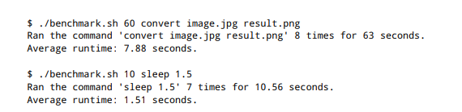
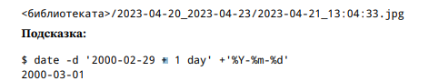
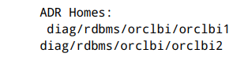
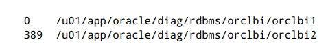

#  Поточна обработка (теми 1,2,3)

### Зад. 1 2016-SE-01

1Даден е текстов файл с име p h i l i p - j - f r y . t x t . Напишете shell script и/или серия от команди,
които извеждат броя редове, съдържащи поне една четна цифра и несъдържащи малка латинска
буква от a до w .

Примерно съдържание на файла:
````text
123abv23
123zz123
MMU_2.4
Примерен изход:
Броят на търсените редове е 2
````

````shell
#!/bin/bash

if [[ "${#}" -ne 1 ]]; then
  echo "The script works with one positional argument - path to the file"
  exit 1
fi 

count="$(cat "${1}" | grep -v [a-w] | grep [2,4,6,8] | wc -l)"

echo "The count of wanted lines is: ${count}"

exit 0
````


### Зад. 2 2017-IN-01
Напишете серия от команди, извеждащи на екрана само броя на всички обекти във файловата
система, чиито собственик е текущият потребител.

Забележка: Във файловата система със сигурност съществуват директории, до които нямате достъп.

````shell
find / -user $(whoami) -print 2>/dev/null | wc -l
# or
find / -uid $(id -u) 2>/dev/null | wc -l
````

### Зад. 3 2017-IN-02 

Напишете серия от команди, които изтриват:

а) всички файлове в текущата директория и нейните поддиректории, които са с нулева дължина.

б) 5-е най-големи файла в home директорията на текущия потребител и нейните поддиректории.

````shell
# a
find . -type f -size 0 | xargs -I {} rm {}
# b
find . -type f -printf "%p|%s\\n" | sort -t "|" -nr -k 2 | head -n 5| awk -F "|" '{print $1} | 'xargs -I {} rm {}
````

### Зад. 4 2017-IN-03 

Напишете серия от команди, които от файла /etc/passwd да вземат под-низ, състоящ се
от втора и трета цифра на факултетния номер на студентите от специалност Информатика, чиито
фамилии завършват на “а”. Изведете коя комбинация от цифри се среща най-често и коя е тя.

````shell
# i will write the solution using out course /etc/passwd
cat /etc/passwd | awk -F':' '{print $1 " " $5 }' | awk -F',' '{print $1}' | cut -c3,4 | sort | uniq -c
````

### Зад. 5 2017-SE-01 
Намерете имената на топ 5 файловете в текущата директория с най-много hardlinks.

````shell
ls -l | sort -rk2 -n | head -n 5 | awk '{print $9}'
````

### Зад. 6 2018-SE-01
Променете правата на всички директории, намиращи се някъде във вашата home директория,
така че да станат такива, каквито биха се получили, ако ги бяхте създали с маска 0022 .

````shell
find ~/ -type d | xargs -I {} chmod 755 {} 
````

### Зад. 62 2023-SE-03

При статистическа обработка на текстове често се налага да имаме списък от думи (наречени “стопдуми”), които се срещат прекалено често и не носят стойност за изследването. Такива думи са например
“you”, “then”, “for” и т.н.
Напишете скрипт stopword_candidates.sh , който приема като аргумент име на директория и извежда
10-те думи, които най-много изглеждат като стоп-думи.
- За да бъде стоп-дума, трябва броят файлове, които я съдържат ≥ 3 пъти да е ≥
(общия брой файлове)/2
- Една дума е по-добър кандидат от друга, ако има по-голям общ брой срещания във всички файлове

Забележки:
- Под “всички файлове” имаме предвид всички обикновени файлове в дадената директория и
нейните поддиректории
- Под “дума” имаме предвид непрекъсната последователност от латински букви (a-z) - всички
останали символи не са част от думите
- За улеснение може да приемете, че във файловете няма главни букви

````shell
#!/bin/bash

if [[ "${#}" -ne 1 ]]; then
  echo "The script accepts one positional argument."
  exit 1
fi 

if [[ ! -d "${1}" ]]; then
  echo "The first argument should be a dir"
  exit 1
fi 
file_count=0

while read file; do
  file_count=$(("${file_count}"+1))
  $( grep -oE '\b[a-zA-Z]+\b' "${file}" | sort | uniq -c | awk '{if ($1 >= 3) {print $2 " " $1 }}' >> word_count.txt )
  $( cat word_count.txt | awk '{print $1 " " 1}' >> file_count.txt )
done < <(find "${1}" -type f 2>/dev/null)

$(rm "word_count.txt")

half=$(("${file_count}"/2))
echo $( cat file_count.txt | sort -k1 | uniq -c | awk -v c="${half}" '{if ($1 >= c) {print $2 }}' | tail -n 10 )

$(rm "file_count.txt")

exit 0

````

### 61 2023-SE-02

Задачата ви е да напишете скрипт b e n c h m a r k . s h , който измерва средното време за изпълнение на
дадена команда. Първият аргумент на скрипта е число (време за провеждане на експеримента, в
секунди), а останалите аргументи на скрипта са измерваната команда и нейните аргументи.
Скриптът трябва да изпълнява подадената команда многократно, докато изтече подаденото време.
Когато това се случи, скриптът трябва да изчака последното извикване на командата да приключи и да
изведе съобщение, описващо броя направени извиквания, общото и средното време за изпълнение.

Забележки:
- Времената се извеждат в секунди, с точност два знака след запетайката.
- Приемете, че времето на изпълнение на частите от скрипта извън подадената команда е пренабрежимо
малко


````shell
#!/bin/bash

if [ "${#}" -lt 2 ]; then
  echo "Usage: $0 <duration in seconds> <command> [arguments...]"
  exit 1
fi

duration="${1}"
shift #  literally "shifts" all the positional parameters to the left by one
command="${@}"

end_time=$(( $(date +%s) + duration )) # date +%s за получаване на текущото време,  date +%s.%N за секунди и наносекунди
count=0
total_time=0

while [ $(date +%s) -lt $end_time ]; do
  start_time=$(date +%s.%N)
  eval "$command"
  end_time_command=$(date +%s.%N)
  
  runtime=$(echo "$end_time_command - $start_time" | bc) # bc за изчисления с плаваща запетая
  total_time=$(echo "$total_time + $runtime" | bc)
  ((count++))
done

if [ $count -gt 0 ]; then
  average_time=$(echo "scale=2; ${total_time} / ${count}" | bc) # scale=2 tells bc to format the result to two decimal places
else
  average_time=0
fi

echo "Ran the command '${command}' ${count} times for a total of $(printf "%.2f" ${total_time}) seconds."
echo "Average runtime: ${average_time} seconds."

exit 0
````

### Зад. 60 2023-SE-01
 See labs/04_05_2024.md


### Зад. 63 2023-SE-04

Напишете скрипт, който открива еднакви по съдържание файлове в дадена директория и използва
тази информация, за да намали заетото място на диска.
Скриптът приема един параметър — име на директория. Примерно извикване: . /dedup.sh ./my-dir
Скриптът трябва да направи две неща:
- ако има файлове с еднакво съдържание, да направи така, че имената на тези файлове да сочат
към едно и също копие на съответните данни
- да изведе съобщение, съдържащо следната информация:
    - колко групи файлове са дедупликирани
    - колко байта от мястото на диска се е освободило
Забележки:
- считаме, че цялата дадена директория се намира върху една файлова система
- ако два файла имат еднакви хеш-суми, считаме, че са еднакви по съдържание

````shell
#!/bin/bash

if [ "$#" -ne 1 ]; then
  echo "Usage: $0 <directory>"
  exit 1
fi

if [ ! -d "$1" ]; then
  echo "The provided argument is not a directory."
  exit 1
fi

directory="$1"
temp_file=$(mktemp)

find "$directory" -type f | while read file; do
  sha256sum "$file" >> "$temp_file"
done

sort "$temp_file" -o "$temp_file" # -o overwrite the existing content 

prev_hash=""
prev_file=""
total_saved=0
dedup_groups=0

while read hash file; do
  if [ "$hash" == "$prev_hash" ]; then
    if [ -n "$prev_file" ]; then # -n the length of the string is non-zero
      filesize=$(stat -c %s "$file")
      rm "$file" && ln "$prev_file" "$file" # remove duplicate and link it to the original
      total_saved=$((total_saved + filesize))
    fi
  else
    prev_file="$file"
    dedup_groups=$((${dedup_groups}+1))
  fi
  prev_hash="${hash}"
done < "$temp_file"

echo "Number of deduplicated groups: $dedup_groups"
echo "Total disk space saved: $total_saved bytes"

rm "$temp_file"
exit 0
````

### Зад. 64 2023-SE-05
Казваме, че командата foo заема памет 𝑋, когато 𝑋 е сумата на заетата физическа памет (rss) на
всички процеси, чиято команда (comm) е foo.
Напишете скрипт, който поглежда процесите на системата през една секунда, докато спрат да съществуват
команди, чиято заета памет е над 65536.
След това, скриптът трябва да изведе всички команди, които са заемали памет над 65536 в поне половината
“поглеждания”

````shell
````


### Зад. 65 2023-SE-06
Напишете скрипт, който копира снимки от дадена директория (която ще наричаме фотоапарата) в
нова директория (която ще наричаме библиотеката), спазвайки определена структура.
Скриптът приема пътищата на двете директории като аргументи, очаквайки, че библиотеката не
съществува и трябва да я създаде.
Снимките са всички файлове в директорията на фотоапарата и нейните поддиректории, чиито
имена завършват на .jpg. Под дата на снимка ще имаме предвид нейното време на модификация
(mtime).
Библиотеката трябва да се състои от поддиректории с имена от вида 2023-04-20_2023-04-23, означаващи
затворени интервали от дни. Скриптът трябва да създаде такива поддиректории и да разположи
снимките в тях, така че да са изпълнени следните свойства:
1. Всяка снимка се намира в такава директория, че датата на снимката да принадлежи на съответния
   интервал от дни
2. За всеки ден от всеки интервал съществува поне една снимка от този ден в този интервал
3. Няма припокриващи се и долепени интервали (между всеки два различни интервала има поне
   един ден без снимка)
   Оригиналните имена на снимките не ни интересуват: скриптът трябва да им даде нови имена, използвайки
   техния mtime, с формат, изглеждащ така:
  

   Бонус за още няколко точки: направете скрипта така, че да може да работи при вече съществуваща
   библиотека, добавяйки снимките от фотоапарата към нея и запазвайки всички 

````shell
#!/bin/bash
if [ "$#" -ne 2 ]; then
  echo "Usage: $0 <source directory> <target directory>"
  exit 1
fi

source_dir=$1
target_dir=$2

mkdir -p "$target_dir"

find "${source_dir}" -type f -iname '*.jpg' | while read file; do
  mod_date=$(date -r "$file" '+%Y-%m-%d')
  mod_time=$(date -r "$file" '+%H:%M:%S')
  year=$(echo "$mod_date" | cut -d '-' -f1)
  month=$(echo "$mod_date" | cut -d '-' -f2)
  day=$(echo "$mod_date" | cut -d '-' -f3)

  date_dir="${year}-${month}-${day}"

  mkdir -p "$target_dir/$date_dir"

  new_filename="${mod_date}_${mod_time}.jpg"

  cp "$file" "$target_dir/$date_dir/$new_filename"
done

exit 0
````


### Зад. 54 2021-SE-01
Разполагате с машина, на която е инсталиран специализиран софтуер, който ползва два потребителски
акаунта – oracle и grid . Всеки от потребителите би трябвало да има environment променлива ORACLE_HOME,
която указва абсолютен път до директория във формат /path/to/dir. В под-директория bin на зададената
директория би трябвало да има изпълним файл с име adrci . Всеки от двата потребителя има собствена
директория diag_dest, която е във вида /u01/app/потребител. Когато някой от потребителите изпълни
неговото копие на командата adrci с параметър exec="show homes" може да получи на STDOUT един
от следните два изхода:
- вариант 1: (неуспех): No ADR homes are set
- вариант 2: (успех):



И в двата случая командата приключва с exit code 0 . Ако командата се изпълни успешно, тя връща
списък с един или повече ADR Homes, които са релативни имена на директории спрямо diag_dest на
съответният потребител.
Напишете скрипт, който може да се изпълнява само от някой от тези два акаунта, и извежда на STDOUT размера в мегабайти и абсолютният път на всеки ADR Home.

- Примерен изход:



````shell
#!/bin/bash

# the solution will work only for oracle

if [[ "$(whoami)" != "oracle" ]]; then
  echo "This script must be run by 'oracle' user."
  exit 1
fi

ORACLE_HOME=$(echo $ORACLE_HOME)
diag_dest="/u01/app/$(whoami)"

output=$(ORACLE_HOME/bin/adrci exec="show homes")

if [[ $output =~ "No ADR homes are set" ]]; then
  echo "No ADR homes are set"
  exit 0
fi

echo "$output" | grep -v 'ADR Homes' | while read -r line; do # -r prevent treating a backslash (\) as an escape char
  full_path="$diag_dest/$line"
  size_mb=$(du -sm "$full_path" | cut -f1) # -s summarize, -m megabytes
  echo "$size_mb $full_path"
done

exit 0
````

### Зад. 46 2021-SE-03 

Напишете shell скрипт, който приема два позиционни параметъра – имена на файлове.
Примерно извикване:

$ ./foo.sh input.bin output.h

Файлът input.bin е двоичен файл с елементи uint16_t числа, създаден на little-endian машина.
Вашият скрипт трябва да генерира C хедър файл, дефиниращ масив с име arr, който:
- съдържа всички елементи от входния файл;
- няма указана големина;
- не позволява промяна на данните.
Генерираният хедър файл трябва да:
- съдържа и uint32_t променлива arrN, която указва големината на масива;
- бъде валиден и да може да се #include-ва без проблеми от C файлове, очакващи да “виждат”
arr и arrN.

За да е валиден един входен файл, той трябва да съдържа не повече от 524288 елемента.
За справка, dump на съдържанието на примерен input.bin:
00000000: 5555 5655 5955 5a55 6555 6655 6955 6a55 UUVUYUZUeUfUiUjU
00000010: 9555 9655 9955 9a55 a555 a655 a955 aa55 .U.U.U.U.U.U.U.U

````shell
#!/bin/bash

if [ $# -ne 2 ]; then
    echo "Usage: $0 input.bin output.h"
    exit 1
fi

input_file=$1
output_file=$2

if [ $(stat -c %s "$input_file") -gt $((524288 * 2)) ]; then # 524288 * 2 bites
    echo "Error: input file is too large."
    exit 1
fi

# this is checked with chatgpt; try to find sth better
# Use xxd to dump the binary data in plain hexadecimal format, with 2 bytes per chunk.
# Remove newlines with tr.
# Insert a space between every two characters using sed, preparing each pair of hex digits to be treated as a separate number.
# Convert hexadecimal numbers to decimal with xargs and printf.
numbers=$(xxd -p -c 2 "$input_file" | tr -d '\n' | sed 's/../& /g' | xargs -n 1 printf "%d\n")

echo "const uint16_t arr[] = {" > "$output_file"
echo "$numbers" | xargs | sed 's/ /, /g' >> "$output_file"
echo "};" >> "$output_file"
num_elements=$(echo "$numbers" | wc -w)
echo "const uint32_t arrN = $num_elements;" >> "$output_file"

exit 0
````

### Зад. 45 2021-SE-02

Един от често използваните DNS сървъри е BIND9, при който описанието на DNS зоните обикновенно
стои в текстови файлове, наричани зонални файлове. За улеснение, в рамките на задачата, ще ползваме
опростено описание на зоналните файлове.
Под whitespace разбираме произволна комбинация от табове и интервали.
Под FQDN разбираме низ, който има допустими символи малки латински букви, цифри и точка; не
може да започва с точка, не може да има две или повече съседни точки, задължително завършва с
точка.

Зоналните файлове съдържат ресурсни записи, по един на ред. Общият вид на даден ресурсен запис e
<ключ> <TTL> <клас> <тип> <RDATA>, разделени с whitespace, например:

astero.openfmi.net. 3600 IN A 185.117.82.99

Където:
- ключ (astero.openfmi.net.) – FQDN
- TTL (3600) – цифри; полето може да липсва
- клас (IN) - главни латински букви; класът винаги е IN
- тип (A) - главни латински букви; някое от SOA, NS, A, AAAA
- RDATA (185.117.82.99) - данни на записа; различни за различните типове ресурсни записи;
всичко след типа до края на реда.

Знакът точка-и-запетая ; е знак за коментар, и всичко след него до края на реда се игнорира.
Във всеки зонален файл трябва да има точно един SOA запис, и той трябва да е първият запис във
файла. Пример за едноредов SOA запис:

astero.openfmi.net. 3600 IN SOA nimbus.fccf.net .root.fccf.net. 2021041901 86400 7200 3024000 3600
    
RDATA-та на SOA запис се състои от два FQDN-а и пет числа, разделени с whitespace.
Въпреки, че горното е валиден SOA запис, за прегледност в зоналните файлове често се ползва следният
синтаксис (многоредов SOA запис, еквивалентен на горния):

astero.openfmi.net. 3600 IN SOA nimbus.fccf.net .root.fccf.net. (
                                2021041901 ; serial
                                86400      ; refresh
                                7200       ; retry
                                3024000    ; expire
                                3600       ; negative TTL
                                )

т.е., поредицата от числа се разбива на няколко реда, оградени в обикновенни скоби, и за всяко число
се слага коментар какво означава.
Първото от тези числа (serial) представлява серийният номер на зоната, който трябва да се увеличава
всеки път, когато нещо в зоналният файл се промени. Изключително важно е това число само да
нараства, и никога да не намалява.
Един от често използваните формати за сериен номер, който показва кога е настъпила последната
промяна в зоналния файл представлява число във вида YYYYMMDDTT, т.е., четири цифри за година,
две цифри за месец, две цифри за дата и още две цифри за поредна промяна в рамките на описания
ден. За последните две цифри (ТТ) има ограничение да са от 00 до 99 (естествено, така не може да има
повече от 100 промени в рамките на един ден).
За удобство приемаме, че конкретен сериен номер (точната поредица цифри) се среща само на едно
място в зоналния файл.
Напишете шел скрипт, който по подадени имена на зонални файлове променя серийният номер в
SOA записа на всеки файл по следният алгоритъм:
- ако датата в серийният номер е по-стара от днешната, новият сериен номер трябва да е от вида
днешнадата00
- ако датата в серийният номер е равна на днешната, серийният номер трябва да се увеличи с
единица

Важат следните условия:
- скриптът трябва да може да обработва и едноредови, и многоредови SOA записи
- за всеки зонален файл, който не е успял да обработи, скриптът трябва да вади съобщение за
  грешка, което включва и името на зоналния файл. Съобщенията трябва да са лесно обработваеми
  с познатите инструменти за обработка на текст

````shell
#!/bin/bash

if [[ $# -eq 0 ]]; then
   echo "Usage: $0 zonefile1 [zonefile2 ...]"
   exit 1
fi

today=$(date +%Y%m%d) 

for file in "$@"; do
    if [[ ! -f "$file" ]];then
      echo "ERROR: File $file not found."
      continue
    fi
      
     # here we assume that the only 10 digit number will be the serial one , we find a better way for finding it
     current_serial=$(grep -Eo '[0-9]{10}' "$file" | head -1)

    if [[ -z "$current_serial" ]]; then
        echo "ERROR: No valid SOA serial number found in $file."
        continue
    fi

    current_date=${current_serial:0:8} # ${variable:start:length} -> extract a substring from $variable.
    revision=${current_serial:8:2}  

    if [ "$current_date" -lt "$today" ]; then
        new_serial="${today}00"
    elif [ "$current_date" -eq "$today" ]; then
        new_revision=$(printf "%02d" $((10#$revision + 1))) # %02 to pad with 0 ;#10 interpret as decimal -> by default bash works with octal
        new_serial="${today}${new_revision}"
    else
        echo "ERROR: SOA serial date is in the future in $file."
        continue
    fi

    sed -i "s/$current_serial/$new_serial/" "$file"
    echo "INFO: Updated SOA serial number in $file to $new_serial."
done

````