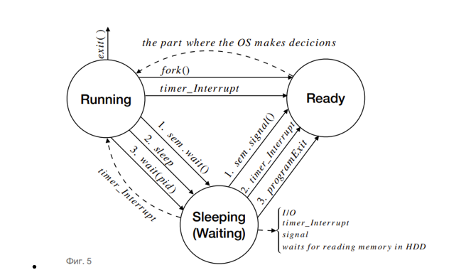

### 1. Опишете с по едно-две изречения работата на следните системни извиквания в стандарта POSIX:

- **pipe()** – Създава неименувана тръба. Приема масив от две цели числа `int fd[2]`, в който се съхраняват двата нови файлови дескриптора, отнасящи се до краищата на тръбата. `fd[0]` съхранява файловия дескриптор за четене, а `fd[1]` – за писане.

- **dup2()** – Създава копие на файлов дескриптор, подаден като първи аргумент, и го записва на номера на файлов дескриптор, подаден като втори аргумент. Ако вторият файлов дескриптор е отворен, той първо бива затворен преди да бъде използван повторно.

- **fork()** – Създава нов процес, копирайки извикващия процес. Не приема аргументи и връща идентификатор на процеса – новият процес (детето) има стойност `0`, а извикващия процес (бащата) има стойност по-голяма от `0`. При грешка, връща стойност `-1`.

- **exec()** – Системните извиквания от това семейство заменят изпълнимия файл на процеса, който се изпълнява в момента, с друг изпълним файл, подаден като първи аргумент. Следващите подадени аргументи могат да се интерпретират като масив от аргументи, които желаната команда да приеме за своето изпълнение.

- **wait()** – Спира изпълнението на извикващия процес, докато някой от процесите-дете не прекрати своето изпълнение. При подаден аргумент, съхранява подробна информация за детето, променило своето състояние.

- **waitpid()** – Спира изпълнението на извикващия процес, докато процесът-дете с идентификатор, равен на подадения аргумент, не промени състоянието си.

- **open()** – Отваря (или създава) файл с име, подадено като аргумент. Връща като резултат стойността на файловия дескриптор, асоцииран с този файл, а при грешка връща `-1`.

- **close()** – Затваря файлов дескриптор, асоцииран с даден файл.

- **read()** – Приема три аргумента – файлов дескриптор, буфер и брой байтове. Опитва се да прочете съответния брой байтове от файловия дескриптор и да ги запише в буфера.

- **write()** – Приема три аргумента – файлов дескриптор, буфер и брой байтове. Опитва се да прочете съответния брой байтове от буфера и да ги запише във файловия дескриптор.

- **lseek()** – Приема три аргумента – файлов дескриптор, отместване и отправна точка. Премества „курсор“-а във файловия дескриптор, на позиция `<отместване>` според отправната точка. Има три вида отправна точка – `SEEK_SET` – от началото, `SEEK_END` – от края, `SEEK_CUR` – от текущото положение.

- **socket()** – Използва се за създаване на комуникационен канал от тип „конекция“. Създава сокет (крайна точка за комуникация) и връща файловия дескриптор, асоцииран с него.

- **bind()** – Присвоява адрес на сокет, създаден със `socket()`. Това извикване се използва за сървърите в конекцията, изградена със `socket()`, а при клиентите не е необходимо. Тази операция се нарича “именуване на сокет”.

- **connect()** – Свързва сокета, посочен от файловия дескриптор, подаден като аргумент, към адреса на сокета, подаден като аргумент.

- **listen()** – Означава сокета, подаден като аргумент, като готов да приема нови входящи заявки за свързване.

- **accept()** – Блокиращо повикване, което чака входящи връзки. След като заявката за връзка бъде обработена, нов файлов дескриптор се връща. Този нов сокет е свързан с клиента (установена е конекцията), а другият сокет остава в състояние `listen` в очакване на допълнителни връзки.


### 2. Каква е спецификата на файловете в следните директории в Linux:

- **/etc** – Съдържа конфигурационните файлове; файлове, които управляват конфигурацията на конкретната изчислителна система след зареждането на операционната система; информация за потребителите, пароли и т.н.

- **/dev** – Съдържа драйверите на системата; в нея се описват устройствата, които са част от изчислителната система; съдържа псевдо файлове, които задават какъв хардуер може да бъде обслужван от нашата система и какъв точно се обслужва.

- **/var** – Системни файлове – logging files, mail directories, printer spool и др.; за данни, не на потребителя, а за споделени данни.

- **/boot** – Информация за ОС преди самото й стартиране; неща, свързани със зареждането на операционната система.

- **/usr/bin** – Съдържа повечето изпълними файлове, които не са необходими за стартиране или поправяне на системата.

- **/home** – Home директориите на потребителите в системата; файловете на конкретните потребители.

- **/usr/lib** – Обектни файлове и библиотеки; може да включва и вътрешни двоични файлове, които не са предназначени да бъдат изпълнявани директно от потребители или shell скриптове.

- **/var/log** – Директорията, съдържаща всички log (журнални) файлове.

- **/proc** – Информация за операционната система в реално време; съдържа псевдо файлове със статистическа информация от ядрото.

- **/bin** – Съдържа изпълними файлове; важни програми, които се изпълняват при стартирането на системата, общодостъпни програми.

- **/usr/doc** – Съдържа всичката необходима документация.

### 3. Опишете функционалността на следните команди в Linux:

- **cd** – Променя текущата директория.
- **mkdir** – Създава директория.
- **rmdir** – Премахва директория.
- **cp** – Копира файл/файлове в посочена дестинация.
- **mv** – Премества/преименува файлове в зададена дестинация.
- **rm** – Премахва файлове.
- **ls** – Показва съдържанието на директория.
- **who** – Показва активните потребители в момента на извикване.
- **find** – Търси файлове/директории по зададени параметри.
- **ps** – Показва подробна извадка за процесите в ОС в момента на извикване.
- **top** – Подобна на командата `ps`, показва подробна информация за процесите в ОС в реално време.
- **vi** – Отваря на конзолата текстов редактор.
- **tar** – Създава компресирани или некомпресирани архивни файлове или ги поддържа и модифицира.
- **gcc** – Компилира програми, написани на C и C++ код.
- **echo** – Показва на дисплея ред от текст/низ, подаден като аргумент/на стандартния вход.
- **read** – Прочита ред текст, подаден на стандартния вход.
- **test** – Проверява типове на файлове и сравнява стойности (числови или низове).
- **if** – (`if <условие>; then <списък команди> fi`); изпълнява команди въз основа на подадени условия; ако подаденото `<условие>` е изпълнено, се изпълнява `<списък команди>`; тялото на конструкцията приключва с думата `fi`; в случай че първоначалното условие не е изпълнено, позволява проверка на допълнителни условия с ключовата дума `elif` – от `else if`; ако никое от подадените условия не е вярно, в `else` могат да се запишат команди, които да бъдат изпълнени.
- **for** – (`for <елемент> in <множество>; do <команди> done`); изпълнява итеративно (циклично) набор от `<команди>` за всеки `<елемент>`, присъстващ в подадено `<множество>`.
- **while** – (`while <условие>; do <команди> done`); изпълнява итеративно (циклично) набор от `<команди>` докато дадено `<условие>` е изпълнено.
- **chmod** – Променя правата на подадените файлове според подадените стойности (могат да бъдат представени както числово, така и символно).
- **cat** – Прочита съдържанието на файл и го извежда на стандартния изход.
- **grep** – Търси редове, отговарящи на подаден образец (pattern), и извежда само съвпадащите редове на стандартния изход.
- **cut** – Извежда само избрани секции/части от редовете на подаден файл/текст; разделя редовете на отделни колони спрямо подаден символ за разделител (по подразбиране е спейс/табулация).
- **sort** – Сортира редовете на подаден файл/текст и извежда сортираното съдържание на стандартния изход.
- **wc** – Извежда броя на новите редове, думите и байтовете за подаден файл.
- **tr** – Заменя символи в даден файл според подадено множество със съответните символи на същата позиция във второто множество или изтрива всички срещания на символите от първото множество.


### Тема 1

Опишете как ОС разделят ресурсите на изчислителната система, дайте примери за основните типове разделяне: 
- Разделяне на пространцството 
- Разделяне на времети (процесори, други устройства).


Опишете с по едно-две изречения разботата на следните системни извиквания в стандарта POSIX:
pipe() dup2() fork() exec() wait() waitpid()

<hr>

- Разпределението на времето се отнася до управлението на процесорното време и достъп до ресурси, като например  входно-изходни устройства, така че да бъдат споделени между няколко процеса или задачи. При разпределянето на процесорното време голяма роля играе типа на процеса. Има няколко вида процеси:
    - foreground/IO процеси – това са процеси, които извършват много входно-изходни операции (например чакат потребителя да въведе някакви данни, да натисне бутон и т.н.). Тези процеси не се нуждаят от много процесорно време, но за тях е характерно, че често ще бъдат приспивани, т.е. ще прекарват много време в структурите между Running и Active, и за тях е важно когато бъдат събудени, много бързо да преминават към Running състояние, т.е. много бързо да им се дава процесорно време, когато го поискат.
    - background/CPU процеси – това са процеси, които извършват много изчисления, т.е. те няма често да бъдат приспивани. Характерно за тях е, че имат нужда от много процесорно време, но няма значение кога ще им бъде предоставено, т.е. няма значение кога ще им се даде възможност да преминат към Running състояние, но е важно, когато са Running състояние, те да прекарат достатъчно време там.
    - real-time процеси - за тях е характерно, че имат определен срок (deadline), в който трябва да им се предостави процесорно време; такива процеси често се срещат например в медицинските роботи, където трябва да се извърши дадена операция и реда и времето на изпълнение на процесите са от критична важност.
    - Важно е предоставянето на процесорно време да бъде съобразено с типа на процесите. В днешните системи за определянето на реда, по който се предоставя процесорно време на процесите се извършва от т.нар. диспечер или Task scheduler. Най-простият начин е процесите, които искат процесорно време, да се пазят в обикновена опашка, като първия процесор, който е пожелал процесорно време, е и първия на който се предоставя. Сигурно е, че няма да настъпи гладуване, т.е. всеки процес след определено време ще бъде предоставен процесор. Проблемът е, че не се взима предвид типът на процесите. Ако даден foreground процес поиска процесорно време, той трябва да изчака всички процеси преди него да завършат, за да получи възможност за работа. В днешните системи се използват много по-сложни начини за определяне на реда. Например на всеки от процесите може да бъде присвоен приоритет 1000, като при всяко изпълнение на процеса, от този приоритет се изважда времето, за което е работил процеса, като се взима процесът с най-висок приоритет. Така, ако даден CPU процес е чакал прекалено дълго, със сигурност ще му бъде дадено процесорно време в определен момент. Друг вариант са fixed и floating приоритети. Всеки път, когато на процесор не му бъде дадено процесорно време се увеличава fixed приоритетът и накрая се взима процесът с най-висок приоритет.
- Разделяне на пространството се отнася до управление на паметта в изчислителната система, ъака че различните процеси да имат достъп до паметта, без да се нарушава тяхната изолация или безопасност. Ресурса е разделен на части и всеки процес получава част от него. Изолацията гарантира, че един процес не може да чете или пише в паметта на друг процес. При разделяне на пространството от значение са не само активните процеси, но и приспаните, тъй като те все пак се нуждаят от даден блок от памет, където да съхраняват данните които използват. Ресурсът се разделя на части и всяка програма или потребител получава част от него. Проблемите, които ОС трябва да решава са следните: Да следи свободните и заети части, да осигури защита на частите, справедливо да разделя ресурса. Примери за ресурси, управлявани по този начин, са оперативна памет и дискова памет. Има два вида разделяне на паметта - статично и динамично; при статичното трябва да се знае каква е максималната големина на всеки файл, като се заделят n последователни блока, в които може да се запише файлът. Това осигурява много бърз достъп до данните, но на практика при повечето файлове не знаем каква ще бъде големината им и искаме да можем да се увеличават, динамично; при втория тип, файлът се разделя на т.нар. фрагменти с определена дължина, като тези фрагменти се разхвърлят по паметта; по този начин не се пази максимална големина на файла, и нарастването му няма да доведе до проблеми.

### Тема 2

- Опишете разликата между времеделене и многозадачност.
- Какви ресурси разделя еднозадачна, еднопотребителска ОС? 

- Опишете с по едно-две изречения разботата на следните системни извиквания в стандарта POSIX:
open() close() read() write() lseek()

<hr>

#### Опишете разликата между времеделене и многозадачност
- Първи отговор: 
    - Времеделенето е споделяне на изчислителен ресурс между много потребители чрез едновременна многозадачност, докато многозадачността е едновременно изпълнение на множество задачи или процеси за определен период от време. Докато споделянето на времето позволява на множество потребители да използват компютърна система едновременно, многозадачността позволява на множество задачи или процеси да използват компютърна система наведнъж. Следователно, многозадачността стои в основата времеделенето.
- Втори отговор: 
    - Времеделенето е техника, при която множество потребители или процеси споделят процесорното време на една изчислителна система. Всеки процес или потребител получава малък времеви отрязък от процесорното време, след което системата превключва към следващия. Това създава илюзия, че всички процеси се изпълняват едновременно, въпреки че в действителност процесорът обслужва един процес във всеки даден момент. Времеделенето е основна концепция в съвременните ОС, особено при многопотребителските системи.
    - Многозадачността е способността на ОС да управлява и изпълнява множество задачи и процеси за определен период от време. Това позволява на множество задачи или процеси да използват компютърната система наведнъж. Това може да се постигне чрез времеделене (превключва менду задачи), но също така може да включва и паралелно изпълнение, ако системата разполага с множество процесорни ядра. 
    - Многозадачността е по-общо понятие, което се отнася до изпълнението на множество задачи едновременно, докато времеделенето е техника за споделяне на изчислителен ресурс между много задачи. 


 #### Какви ресурси разделя еднозадачна, еднопотребителска ОС? 

Еднозадачната еднопотребителска ОС е операционна система, която позволява на един потребител да изпълнява само една задача наведнъж. Функции като отпечатване на документ, изтегляне на изображения и т.н., могат да се изпълняват само по една. Тази операционна система заема по-малко място в паметта. Еднозначната еднопотребителската заделя всички ресурси за този един потребител и тази една задача.

### Тема 3

- Дайте кратко определение за многозадачна ОС, многопотребителска ОС, времеделене.
- Опишете разликата между многопотребителска и многозадачна работа. Какви качества на ОС характеризират тези две понятия? 
- Опишете с по едно-две изречения разботата на следните системни извиквания в стандарта POSIX: open() close() lseek() pipe() dup2()

<hr>

#### Дайте кратко определение за многозадачна ОС, многопотребителска ОС, времеделене

- Многозадачната ОС изпълнява няколко задачи едновременно. Това се постига чрез разделение на времето на работа на процесора според инструкциите на специална подсистема (task scheduler). При разпределена многозадачност, ОС отпуска на задачата определено време да ползва процесора. Ако тя не успее да приключи за това време, ОС я форсира да отстъпи процесора на следващата задача, която се нуждае от него. При кооперативната многозадачност, приложението, стартирано от ОС, използва 100% от процесора. В този случай, ако друга програма изиска процесорно време, то или няма да ѝ бъде предоставено, което ще доведе до нарушаване на функциите на това приложение и/или до терминирането му, или ще бъде предоставено след приключване на първото.
- Многопотребителската ОС разширява концепцията за многозадачност, като различават потребителите по отношение ползването на процеси и ресурси, като например дисково пространство. Те планират ефикасното използване на ресурсите на системата и могат да съдържат специализиран софтуер за изчисление на процесорното време от много потребители, както и да отчитат използваната памет, ползване на принтер и други използвани ресурси.
- Времеделенето е техника, при която множество потребители или процеси споделят процесорното време на една изчислителна система. Всеки процес или потребител получава малък времеви отрязък от процесорното време, след което системата превключва към следващия. Това създава илюзия, че всички процеси се изпълняват едновременно, въпреки че в действителност процесорът обслужва един процес във всеки даден момент. Времеделенето е основна концепция в съвременните ОС, особено при многопотребителските системи.Времеделенето позволява създаването на многопотребителски системи, в които централният процесор и блокът на оперативната памет обслужват много потребители. При това част от задачите (като въвеждане или редактиране на данни) могат да се изпълняват в диалогов режим чрез терминали, а други (като обемните изчисления) – в пакетен режим.

#### Опишете разликата между многопотребителска и многозадачна работа.

Разликата между многопотребителска и многозадачна операционна система е, че при многозадачната ОС е възможно да имаме един потребител, който да иска едновременно да изпълнява няколко задачи. При многопотребителската система имаме множество от потребители, всеки от които иска да изпълнява някакви задачи, като се предоставя възможност на всеки от потребителите да работи, като по този начин изглежда, че за всеки потребител има отделно ядро, което всъщност не е така.

### Тема 4

- Опишете ситуацията съревноваване за ресурси (race condition), дайте пример. 
- Опишете накратко инструментите за избягване на race condition: 
    - дефинирайте критична секция, атомарна обработка на ресурса 
    - инструменти от ниско ниво, специфични хардуерни средства
    - инструменти от високо ниво, които блокират и събуждат процеси
- Каква е спецификата на файловете в следните директории в Linux: /etc /dev /var /boot /usr/bin /home /usr/lib /var/log

<hr>

#### Опишете ситуацията съревноваване за ресурси (race condition), дайте пример.

Race condition, буквално може да се преведе "борба за ресурси" е състояние, което настъпва когато два или повече процеса едновременно се опитат да достъпят даден споделен ресурс, като започва надпревара за това кой процес ще достъпи паметта първи, което води до непредвидими или нежелани резултати. Това може да настъпи както в мултипроцесорна, така и в еднопроцесорна система, в който случай изпълнението на програмата може да зависи от интервалите между инструкциите, които се изпълняват последователно от един процесор. Например, ако два процесса зависят от стойността на една глобална променлива и двата процеса променят и цетат стойността на променливата, но реда на изпълнение не е определен, може да се стигне до ситуация, където единия процес променя стойността на променливата, докато другия процес очаква тя да бъде старата. 


#### Опишете накратко инструментите за избягване на race condition
- дефинирайте критична секция, атомарна обработка на ресурса.
    - Критична секция: Всеки процес, който работи със споделен ресурс има поне едно място в кода си, в което той използва този споделен ресурс. Тази част от кода се нарича критична секция.
    - Атомарна обработка на ресурса: Инструкции, които променят бит и го прочитат след това като една единна непрекъсната инструкция.
- инструменти от ниско ниво, специфични хардуерни средства.
  - Най-простият инструмент за избягване на race condition e spinlock. Това е инструмент на най-ниско ниво, който на практика ни дава възможност да "заключим" достъпа до даден ресурс, когато го използваме ние, и да го "отключим" в последствие, когато вече не го използваме. Това става с наличието на един допълнителен бит, който ни указва дали ресурса е свободен за използване, или не е. Това обаче не е достатъчно, тъй като ако даден процес се извика рекурсивно, то всеки следващ процес ще зацикли и бита никога няма да се освободи, т.е. паметта ще остане винаги заключена, т.нар. deadlock. Освен този бит, е важно да се забранят прекъсванията, така че да не може да се стигне до зацикляне. В spinlock присъстват следните хардуерни инструменти за защита – enable/disable interrupt, test-and-set и atomic swap.
- инструменти от високо ниво, които блокират и събуждат процес.
	- Семафорът е абстрактен механизъм от високо ниво за синхронизация на процеси, използващи общи ресурси. Основава се на принципа за приспиване и събуждане на процес. Ако един процес няма работа, която да извърши в даден момент, и очаква външно събитие, то той бива приспан до настъпване на чаканото събитие. Когато споделеният ресурс е наличен отново, процесът се събужда и продължава изпълнението си от там, докъдето е стигнал


### Тема 5 

- Хардуерни инструменти за защита(lock) на ресурс:
    - enable/disable interrupt
    - test and set 
    - atomic swap
- Опишете инструмента spinlock, неговите предимства и недостатъци.
- Каква е спецификата на файловете в следните директории в Linux: /etc /dev /var /proc /bin /home /usr/doc

<hr>

#### Хардуерни инструменти за защита(lock) на ресурс

- enable/disable interrupt: Инструкцията блокира временно хардуерните прекъсванията, след което може пак да ги разрешава. Когато се влезе в режим на работата в ядрото, кода извиква процедура от ядрото да го изпълни и може да се сложи в опашката инструкция да спре и да пусне прекъсванията.
- test and set: Тази инструкция се използва, за да се пише в паметта и да се върне старата стойност като атомарна операция.
- atomic swap: Атомарната инструкция се използва да се постигне синхронизация. Тя сравнява съдържанието на локация в паметта с дадена стойност и само ако са същите, модифицира съдържанието с новата стойност.

#### Опишете инструмента spinlock, неговите предимства и недостатъци

Това е инструмент на най-ниско ниво, който на практика ни дава възможност да "заключим" достъпа до даден ресурс, когато го използваме ние, и да го "отключим" в последствие, когато вече не го използваме. Основната задача на spinlock е да предотврати конкурентния достъп до споделен ресурс от няколко процеса едновременно, като използва активно изчакване (spin-waiting) вместо да блокира процеса, който се опитва да влезе в критичната секция.
Приемаме че хардуерът разполага със специални инструменти за атомарна обработка на ресурсите, напр. test_and_set(), който атомарно (като 1 инструкция) да проверява каква е текущата стойност и съответно да присвоява нова стойност. Базирайки се на това допускане, можем да дефинираме друг инструмент от ниско ниво за справяне със race condition - т.нар spinlock. При него имаме един допълнителен бит - lock, който пази стойност 0 ако ресурса е свободен, и стойност 1, ако е зает. Тъй като този бит е споделен ресурс за обработката му ще използваме test-and-set. Реализацията на този инструмент би изглеждала така:
```
spinlock R=test_and_set(lock)
if(R==1) goto spinlock
critical_section
unlock(lock)
```
Тук обаче е възможно да възникне проблем, ако процесора прекъсне изпълнението на процеса, затова е важно да се забранят прекъсванията.

```
spinlock disable_interrupts
R=test_and_set(lock)
if(R==0) goto critical_section
enable_interrupts
goto spinlock
critical_section
unlock(lock)
enable interrupts
``` 

Важно е да се отбележи, че не можем да имаме рекурсия в критичната секция, защото по този начин извикания процес ще чака lock-a да се освободи, а текущия процес ще чака рекурсивно извикания да приключи своето изпълнение - което никога няма да се случи, т.е. ще настъпи deadlock.

- Недостатъци: ако критичната секция, за която се изполва spinlock, има дълга продължителност на изпълнение, активното изчакване на процесора може да доведе до загуба на производителност
- Предимства: при кратки критични секции или при наличие на много ядра, които освобождават ресурси бързо, времето прекарано в контекстно превключване, може да бъде по-фълго от активното изчакване


### Тема 6 

- Опишете понятията приспиване и събуждане на процес(block/wakeup)
- Семафор - дефиниция и реализация
- Опишете разликата между слаб и силен семафор
- Опишете накратко различните видове специални файлове в Linux: външни устройства наименувани в /dev, псевдофайлове в /proc, линкове - твърди и символни, команда ln, сокети

<hr>

#### Опишете понятията приспиване и събуждане на процес(block/wakeup)

Когато даден процес чака определено събитие да настъпи, независимо дали това събитие е някакъв момент във времето, някакви входно-изходно операции, или конкретно събитие, той бива приспан (block). Обикновено процесът се приспива сам, като извика block(), а по-късно, когато настъпи конкретното събитие, някакъв друг процес го събужда (wakeup).  Приспиваните процеси не използват процесорно време. Пример: процес може да бъде приспан, ако изчаква данни да бъдат прочетени от входно устройство или ако е в опашка за достъп до заключен ресурс.

#### Семафор - дефиниция и реализация

- Семафорът е абстрактен механизъм от високо ниво за синхронизация на процеси, използващи общи ресурси. Основава се на принципа за приспиване и събуждане на процес. Ако един процес няма работа, която да извърши в даден момент, и очаква външно събитие, то той бива приспан до настъпване на чаканото събитие. Когато споделеният ресурс е наличен отново, процесът се събужда и продължава изпълнението си от там, докъдето е стигнал. Семафорът преставлява абстрактен тип от данни, който се използва за броене или за ограничаване на броя на процесите, които могат да достъпят даден ресурс едновременно. 
- Имплементация на семафор 
```c
// pseudo code
struct Semaphore{
    int cnt =0
    list L = () 
    bit lock = 0

    init(int _cnt) {
        cnt = _cnt
    }

    wait(){
        spin_lock(lock);
        cnt = cnt - 1
        if (cnt < 0) {
            L.put(self);
            spin_unlock(lock)
            block()
        } else spin_unlock(lock)
    }

    signal(){
        spin_lock(lock);
        cnt = cnt + 1
        if (cnt <= 0) {
            pid = L.get()
            spin_unlock(lock)
            wakeup(pid)
        } else spin_unlock(lock)
    }
}
```
- Структурите от данни, необходими за реализация на семафор са: Брояч cnt, в който се пази броя на процесите, които могат да бъдат допуснати до ресурса, охраняван от семафора. Контейнер Q, в който се пази информация кои процеси чакат достъп до ресурса.
- Процедурите (методите), необходими за реализация на семафор са: Конструктор init(int n), който задава начална стойност на брояча n и инициализира контейнера празен. Метод wait(), който се ползва при опит за достъп до ресурса. Броячът се намалява с единица и ако той стане отрицателен, процесът, извикал wait() се блокира, а номерът му се вкарва в контейнера Q. Метод signal(), който се използва при освобождаване на ресурса. Броячът се увеличава с единица и ако контейнерът Q не е празен, един от процесите в него се изкарва и активира.

#### Опишете разликата между слаб и силен семафор

Един семафор е силен, когато контейнерът Q е реализиран като обикновена опашка (на принципа „first in, first out“ – активираме процеса, блокиран най-рано). Семафорът е слаб, когато контейнерът Q е реализиран като приоритетна опашка – активираме процес, който не е влязъл най-рано в него.

####  Опишете накратко различните видове специални файлове в Linux: външни устройства наименувани в /dev, псевдофайлове в /proc, линкове - твърди и символни, команда ln, сокети

- външни устройства, именувани в /dev – файловете в тази директория са псевдофайлове, съответстващи на периферни устройства; задават какъв хардуер може да бъде обслужван от нашата система и какъв точно се обслужва;
- псевдофайлове в /proc – В директорията /proc е вградена виртуалната файлова система Proc file system (procfs), която се създава в движение при стартиране на системата и се разтваря в момент на спиране на системата. Тук се съдържа полезна информация за процесите, които се изпълняват в момента – разглежда се като контролен и информационен център за ядрото. В директорията има директории с име PID на всеки процес в системата, всяка от които съдържа подробна информация за този процес.
- линкове – твърди и символни, команда ln
    - Symbolic link – псевдофайл, който представлява алтернативно име за друг файл или директория. Те могат да сочат към всички видове файлове (нормални файлове, директории, специални файлове, други символни линкове и т.н.). Ако бъде преименуван, преместен или изтрит оригиналният файл, линкът става невалиден (счупен; broken). Те могат да имат различни права на достъп от файловете, към които сочат.
    - Hardlink – За разлика от symbolic links, които сочат към името на друг файл, твърдите линкове се насочват към inode-а на съществуващ файл. По този начин различни имена на файлове се свързват към един и същ inode. Не могат да сочат към директории. Преименуването, преместването или изтриването на „оригиналния“ файл няма ефект върху тях. Промяната на правата на достъп на файл променя правата на достъп на всички негови твърди линкове.
    - ln – създава линкове към файлове; ако не подадем на командата никакви флагове, тя създава hardlink на подадения файл; ако подадем на командата -s, тя създава symbolic link на подадения файл 
- сокет - специален файл, използван за комуникация между процесите (инструмент за създаване на комуникационен канал от тип конекция), който позволява комуникация между два процеса без роднинска връзка. За разлика от именуваните тръби, които позволяват само еднопосочен поток от данни, сокетите са напълно съвместими с дуплекс. При изпълнение на команда ls -l, сокетите са отбелязани със символ ‚s‘ като първа буква на символната репрезентация на правата за достъп.

### Тема 7

- Взаимно изключване - допускане само на един процес до общ ресурс. Опишете решение със семафори. 
- Качества и свойства на конкретните файлови системи, реализирани върху block devices. 
- Ефективна реализация, отлагане на записа, алгоритъм на асансъора.

<hr>

#### Взаимно изключване - допускане само на един процес до общ ресурс. Опишете решение със семафори. 

- Взаимно изключване (mutual exclusion или mutex) е основен принцип в синхронизацията на процеси, който гарантира, че само един процес може да има достъп до даден общ ресурс в даден момент. Това предотвратява възникването на race condition, при който два или повече процеси едновременно манипулират споделен ресурс, което може да доведе до непредсказуемо поведение или повреда на данните. При взаимното изключване искаме най-много един процес да достъпва определен споделен ресурс по едно и също време. Например, нека p1, p2 и p3 формират критичната секция на процеса P и нека P има много копия, т.е. множество копия на P могат да работят паралелно. Искаме само едно копие на P да може да достъпва критичната секция по едно и също време.
- Тази синхронизационна задача може да се реши като си дефинираме семафор s така и добавим следните синхронизационни инструкции в кода на P:
```
s.init(1);

P
s.wait()
p1
p2
p3
s.signal()
```
- По този начин, първото копие на процеса P ще започне да изпълнява критичната си секция, като брояча на семафора ще стане 0. След това, всяко следващо копие, което се опита да достъпи критичната секция ще бъде приспивано, докато първото не приключи изпълнението си, и не събуди едно от приспаните копия.

#### Качества и свойства на конкретните файлови системи, реализирани върху block devices. 

Съвременната файлове система, реализирана върху блоково устройство, трябва да удовлетворява няколко основни изисквания и да използва различни инструменти за подобряване на ефективността и надежността на операциите с данни. 
Изисквания, които удовлетворява съвременната файлова система върху блоково устройство: 
- организация на данни - ФС трябва да организира данните върху блокове на физическото устройство. Блокът е минималната единица за четене и запис
- управление на пространството - ФС трябва да управлява свободното и заетото пространство на устройството, включително алокация и освобождаване на блокове
- кеш - използване на кещ памет за подобряване на скоростта на достъп до често използвани блокове
- осигуряване на цялост - ФС трябва да осигури цялост на данните, осигурявайки тяхното коректно съхранение и възстановяване в случай на сбой (журнална файлова система)

#### Ефективна реализация на файловата система 
- Твърд диск – това е диск разделен на много „пътечки“:
    - Над повърхнината има устройство, което засича дали битът е 1 или 0;
    - Придвижването на главата на това устройство от една пътечка на друга е механично и става бавно;
    - Всяка пътечка е разделена на няколко сектора от по 512 или 1024 байта;
    - Главата не се допира до диска, а лети много малко над повърхността;
    - Софтуера знае колко е голям сектора и колко е времето за преминаване от един до друг сектор;
    - Файла се представя като много сектори;
    - Не са последователно разпределени байтовете на файловете, защото така не могат лесно да нарастват;
    - Файлът се разполага там където може, процесът на разхвърляне се нарича фрагментация.

#### Отлагане на запис

Цел: отлагането на запис се използва за подобряване на ефективността на ФС чрез събиране на няколко операции за запис в един или повече блокове преди тяхното физическо записване на устройството. 
- Записваме промените във файл, който се нарича журнал – в него се запазва пълната информация за операциите над файлове и когато се запълни журналът, спираме и отразяваме операциите от журнала над файловете. Ако спре токът, журналът ще пази последните промени, а файловете ще са консистентни. Четат се първо старите файлове и се проверява дали в журнала са променени. Ако спре токът, докато пишем операцията/транзакцията, тя няма да се е изтрила преди да е завършила и затова ще я пазим все още в журнала. Във файловите системи транзакцията е елементарна файлова операция (read, write, open). Журналът (log файл) се намира или в друг диск или в друг дисков дял, за да може двете паралелно да работят, но в персоналните устройства журналът е файл в самата файлова система или в същия дял.

#### Алгоритъм на асансъора 

Цел: Този алгоритъм се използва за оптимизиране на времето за достъп до блокове на твърдия диск, като се минимизира времето за търсене на главата на диска. 
- Реализация: главата на диска се движи по направление нагоре или надолу върху пътеката на диска. Когато се инициира операция за четене или запис  на блок от данни, алгоритъмът определя последователността, в която ще бъдат достъпвани блоковете върху диска. Той работи по следния начин: 
    - Алгоритъмът започва от текущото положение на главата на диска
    - Ако има още блокове за достъпване в същото направление (нагоре или надолу), главата продължава движението си
    - Когато няма повече блокове в текущото направление, главата ще се обърне и ще продължи в противоположното направление
    - това продължава до достигане на последния блок, който трябва да бъде достъпен
- Алгоритъмът на асансьора се изразява в следното: Разместват се така заявките към четене и писане, че главата да изминава минимално разстояние; Има две приоритетни опашки: едната се състои от файлове, които се намират по посока на движението на главата, а другата от файлове, които се намират в обратната посока; Ако е празна главата на опашката по посока на главата на устройството, то се сменя посоката.


### Тема 8 

- Комуникационна тръба (pipe), която съхранява един пакет информация- реализация чрез редуване на изпращача/получателя
- pipe с буфер - тръба, съхраняваща n пакета информация. Използване на семафори като броячи на свободни ресурси
- Права и роли в  UNIX, командата chmod
- Роли - u/g/o user/group/other
- Права - r/w/x read/write/execute

<hr>

#### Комуникационна тръба (pipe), която съхранява един пакет информация- реализация чрез редуване на изпращача/получателя

Комуникационната тръба е механизъм за междупроцесна комуникация, която позволява на един процес да изпраща данни към друг. В случая, ще реализираме тръба, която може да съхранява един пакет информация като се редуват изпращача и получателя. Тази реализация изисква синхронизация, за да се гарантира, че изпращачът няма да изпрати нов пакет преди получателят да е прочел текущия, и обратното - получателя да не се опитва да чете преди да има нещо изпратено. 
- реализация със семафора и каунтър

#### pipe с буфер - тръба, съхраняваща n пакета информация. Използване на семафори като броячи на свободни ресурси

- Тръбата се ползва от няколко паралелно работещи изпращачи/получатели на байтове. Процесите изпращачи слагат байтове в края на опашката, получателите четат байтове от началото на опашката.
- Необходими структури от данни:
    - Опашка (или масив) Q с n елемента – тъй като е възможно да имаме бърз и бавен процес (например: единия чете бързо, а другия пише бавно) е нужно опашката да бъде по-дълга, за да не се приспива по-бързия процес (приспиването е бавна операция, тъй като включва в себе си смяна на контекста). В началото тази опашка ще е празна;
    - free_bytes - семафор, който ще индикира за свободните байтове в опашката;
    - ready_bytes - семафор, който ще индикира колко байта са готови за четене (до колко е запълнена опашката);
    - mutex_read – мутекс, който ще защитава критичната секция за четене;
    - mutex_write - мутекс, който ще защитава критичната секция за писане.
- Процесът, който чете, първоначално ще проверява дали има готови за четене байтове. Ако няма, той ще се приспи и ще чака да постъпят такива. Ако има, той ще провери дали някое друго копие на P не чете в момента. Ако да, той отново се приспива. Ако не, той ще прочете байт и ще го запише в променливата. След това ще сигнализира, че в опашката има още един свободен байт чрез подаване на сигнал на семафора free_bytes.
- Процесът, който пише, първоначално ще провери дали има свободни байтове в опашката. Ако няма, ще се приспи и ще чака да се освободят байтове. Ако има, ще трябва да провери дали някое друго копие на пишещ процес не пише в момента в опашката. Ако да, то отново процеса ще се приспи. Ако не, ще сложи байта си  в опашката и ще сигнализира, че още един байт е готов за четене, което се осъществява чрез подаване на сигнал на семафора ready_bytes.
```
Инициализация:
free_bytes.init(n)
ready_bytes.init(0)
mutex_read.init(1)
mutex_write.init(1)

READ:	           
byte b
p1
p2
…
ready_bytes.wait()
mutex_read.wait()
 b = Q.get()
mutex_read.signal()
free_bytes.signal()


WRITE:
byte b
q1
q2
…
free_bytes.wait()
mutex_write.wait()
 Q.put(b)
mutex_write.signal()
ready_bytes.signal()
```

#### Права и роли в UNIX

- Роли – u/g/o user/group/others
    - Всеки файл и директория имат 3 вида групи по отношение на роли: Потребител (User/Owner), Група (Group) и Други (others).
        - Потребителят е собственикът на файла. По подразбиране, при създаване на файл, лицето, създало файла, става негов собственик.
        - Групата съдържа множество потребители. Всички потребители, принадлежащи към групата, на която принадлежи файлът, имат едни и същи права за достъп.
        - Други са всички останали потребители - нито са собственици на файла, нито принадлежат към потребителската група, притежаваща файла. На практика това означава всички останали.
- Права – r/w/x read/write/execute
    - Всеки файл и директория има 3 вида права: Четене (Read), Писане (Write) и Изпълнение (Execute).
        - Четене: Дава правото да отваряме и да четем съдържание на даден файл. При директориите, дава възможност да видим нейното съдържание.
        - Запис: Дава правомощието да променяме съдържанието на файл. При директориите, дава правото да добавяме, премахваме и преименуваме файлове, съхранявани в директорията.
        - Изпълнение: Ако разрешението за изпълнение не е зададено, не можем да стартираме изпълним файл. При директориите ситуацията е малко по-особена. Ако сравним с правата за четене, там можем само да видим съдържанието на дадената директория (например с команда ls), но ако нямаме права за изпълнение за дадената директория, не можем да я достъпваме.
- chmod – правата за различните роли и групи се сменят с командата chmod. Тя приема като аргументи символна или числена репрезентация на новите права, които искаме да зададем за конкретния файл, както и самия файл, който искаме да променим.


### Тема 9 
 - Взаимно блокиране (deadlock)
 - Гладуване (livelock, resource starvation)
 - Пример: задача за философите и макароните
 - Единна йерархична файлова система в UNIX
 - Файлове и директории, команди - cd, mkdir, rmdir, cp, mv, rm

 <tr>

#### Взаимно блокиране

Deadlock е събитие, което се настъпва, когато процес чака друго събитие, което никога няма да се случи. Обикновено това се получава, когато нишка/процес чака мютекс или друг семафор, който никога не се освобождава от предишния си ползвател, както и при ситуации, когато имаме два процеса и две заключвания.
```
Thread 1:                   Thread 2:
Lock1 -> lock()         Lock2 -> lock()
WaitForLock2()	        WaitForLock1()
```
- Има четири условия, които трябва да бъдат изпълнени, за да можем да сме сигурни, че ще възникне deadlock:
    - Условие за взаимно изключване. Поне един процес да използва споделен ресурс монополно, т.е. да има ексклузивни права над него (да няма възможност друг процес да наруши работата му).
    - Условие за задържане и изчакване. Може да се случат поредици при които процес взима даден ресурс и чака да вземе следващия.
    - Ползването на споделен ресурс в първото условие да не може да бъде прекъсвано от външен фактор.
    - Условие за кръгово (циклично) изчакване.

#### Гладуване (livelock, resource starvation)

- Livelock се случва, когато два или повече процеса непрекъснато повтарят едно и също взаимодействие в отговор на промените в другите процеси, без да извършват полезна работа. Тези процеси не са в състояние на изчакване и те се изпълняват едновременно. Това е различно от deadlock, тъй като при deadlock всички процеси са в състояние на изчакване. Правят се непрекъснати опити за изпълнение на определена задача, но не успяват да я завършат поради липса на достъп до ресурси или поради непрекъснато прекъсване от други процеси.
- Starvation настъпва, когато „алчните“ (greedy) нишки използват споделените ресурси прекалено дълго и ги правят недостъпни за останалите процеси за дълги периоди. Да предположим например, че обектът предоставя синхронизиран метод, който често отнема много време, за да се върне. Ако една нишка често извиква този метод, други нишки, които също се нуждаят от чест синхронизиран достъп до същия обект, често ще бъдат блокирани. Обикновено гладуването е причинено от прилагането на твърде опростен алгоритъм за съставяне на разписания, по които процесите се изпълняват – не се взима под внимание типът на различните процеси.

#### Пример: задача за философите и макароните

Разглеждаме кръгла маса, на която са седнали 5 философа и се опитват да се нахранят. По средата на масата има купа със спагети, а пред всеки философ има по една чиния и между всеки две чинии има вилица. За да си сложи от спагетите в чинията и да се нахрани, на даден философ са му необходими две вилици едновременно.
- Правим допускането, че философите знаят как да мислят и как да се хранят. Нашата работа е да напишем версия на разпределение на ресурсите (вилиците), в която да са изпълнени следните синхронизационни ограничения:
    - Когато един философ е взел вилица, никой друг не може да я ползва;
    - Да не е възможно да се появи deadlock;
    - Да е възможно повече от един (в нашия случай – повече от двама) философа да се хранят по едно и също време;
    - Да не е възможно философ да гладува дълго време докато чака за вилица.
- Ако всеки философ се опита да вземе първо лявата или дясната вилица, тогава ще настъпи deadlock, защото, за да се нахрани са му нужни две вилици, които да използва едновременно и всеки философ ще чака и ще гладува вечно.
- Може да моделираме лесно тази ситуация с двуделен граф. Процесите ще са философите, а ресурсите ще са вилиците. С ребрата в графа ще обозначаваме необходимостта от ресурс на процес, за да може да си свърши работата. 
- Нека разгледаме горепосочената ситуация, в която всеки философ си е взел лявата вилица и се опитва да вземе дясната. Ще насочим ребрата на графа, за да обозначим това, като посоката ще е от процес към ресурс, а пък обратната посока ще означава, че процесът се опитва да вземе този ресурс, но той е зает. При такова ориентиране на ребрата се получава цикъл и това води до deadlock.
- Нека номерираме множеството от процеси и множеството от ресурси, така че да знаем на кой процес кои ресурси са необходими. След като знаем на кой процес какво множество от ресурси е необходимо, за да си свърши работата, то той ще може да си го сортира и да ги взема по реда на номерата. Тогава алгоритъмът няма да е: „всеки да взима лявата вилица“, а ще е „всеки да взима вилицата с по-малък номер“. Така deadlock няма да настъпи (естествено има малка вероятност за гладуване на някои философи, но deadlock няма да има).


#### Единна йерархична файлова система в UNIX.

В UNIX абстрактната файлова система е кореново дърво. Коренът представя началото на файловата система. Върховете представляват директории, а листата - файлове, като всеки връх (директория) също представлява кореново дърво. Възможно е две файлови системи да бъдат закачени една към друга, като това се осъществява чрез командата mount, която монтира (закача) едната файлова система към другата. Командата unmount служи за откачане на една файлова система от друга. Има някои специални директории, които присъстват във всяка файлова система (напр. /dev , /etc, /tmp), като когато добавим някакво външно устройство (напр. когато свържем флашка към компютъра), това устройство се появява във файловата система. Към всеки файл, освен името и съдържанието, се асоциират и други атрибути - тип на файла ("-" - обикновени файлове, "d" - директории, "c" - символно устройство/character special device (напр. клавиатурата), "b" - блоково устройство/block special device – външно у-во, което съхранява масив от байтове, "p" - именувана тръба (FIFO), "s" - socket/конектор – крайна точка за комуникация), права за достъп, потребител, потребителска група, размер, дата на промяна, дата на създаване и др. В Linux тези атрибути се пазят отделно от самия файл, което от една страна прави достъпа до тях по-бавен, но от друга страна дава възможност за съществуването на т.нар. hardlinks, т.е. за създаване на друго име на файла (файлът ще бъде същия, понеже ще сочи към същите атрибути, но името му може да бъде различно). По този начин, файлът ще бъде изтрит от паметта чак когато всички hardlinks към него се изтрият.

#### Файлове и директори
- Файлове: в UNIX всичко се разглежда като файл - включително обикновените текствои файлове, директории, устройства, и дори сокети. Всеки файл в системата има име, тип, размер и други метаданни като права за достъп и времеви маркери. Обикновените файлове съдържат данни, програми или текст. Пример за обикновен файл е такстов файл като notes.txt или изпълним файл като program.
- Директории: директориите са специален тип файлове, които съдържат други файлове и поддиректории. Те играят ролята на контейнер, който организира файловете в логическа структура. Директория може да съдържа хиляди файлове и поддиректории, всяка от които може да съдържа още файлове и поддиректории, формирайки йерархия. 

#### Тема 10

- Процеси в многозадачна система
- Превключване, управлявано от синхронизация
- Превключване във система с времеделене - timer interrupt
- Опишете функционалността на следните команди в Linux: ls, who, find, ps, top

<tr>

#### Процеси в многозадачна система

Многозадачността е способността на ОС да управлява и изпълнява множество процеси едновременно. Многозадачните системи разпределят системните ресурси между процесите, особено процесорно време, оперативна памет и входно-изходни устройства. 
- Процесът е работеща програма, съществуваща във времето, която има начало и край. Има различни състояния: R, A, S. Процесите могат да бъдат спящи (те чакат входно-изходни операции или момент от времето), активни (в момента активен процес, но който чакат CPU) и работещи(такива, които ползват CPU в момента).

#### Превключване, управлявано от синхронизация

Превключването, управлявано от синхронизация се отнася до сценарии в многозадачна система, когато контекстното превключване между процеси се предизвиква от необходимостта за синхронизация, а не от прекъсвания на процесора или планиращ алгоритъм. Това обикновено се случва, когато един процес трябва да изчака определено условие или ресурс да стане достъпен, преди да продължи изпълнението си. ОС превключва към друг процес, за да не губи процесорно време, докато първия процес чака. Доста е ефективен, тъй като не се губи време за активно изчакване. 
-Един процес преминава от едно състояние в друго: 
    - Преход: Работещ процес да премине в спящо състояние. Този процес се нарича блокиране. Това настъпва, когато процесът чака входно/изходна операция(wait - предизвиква се от синхронизиращия механизъм - семафора, който от своя страна приспива процеса, само ако ресурсът е зает) или ако чака момент от времето(sleep - предизвикан от синхронизираща операция, която задължително го приспива)
    - Спящият процес може да премине в активен (да се събуди). Събуждането на процеса се предизвиква от завършването на входно-изходна операция на друг процес, който чрез signal() ще подаде сигнал, че е освободен ресурс. 

#### Превключване във система с времеделене - timer interrupt
Времеделенето е техника, при която множество потребители или процеси споделят процесорно време на една изчислителна система. Всеки процес или потребител получава малък времеви отрязък от процесорното време, след което системата превключва към следващия. Това създава илюзия, че всички процеси се изпълняват едновременно, въпреки че в действителност процесът обслужва един процес във всеки даден момент.
- Работещ процес може да промени състоянието си на блокиран (да му бъде отнето процесорното време), ако твърде много време прекара в процесора. В такъв случай времето му изтича и той бива прекъснат от таймер, за да освободи CPU ресурс. Това е така заради времеделенето и всеки процес има максимално количество време, което може да работи. Обслужването на спирането се извършва от алгоритъм в ядрото, а самото спиране от часовника. Активният процес, преминава в работещ, когато му се предостави процесорно време. Извършва се смяна на работещия процес, поради изтичане на време на даден процес, ядрото тогава решава, кой чакащ процес да заработи (зависи от алгоритъма на ядрото и то неговия task scheduler). Когато спящият процес е приспан заради очакване на момент от времето, то той може да стане активен, като този процес се инициира от timer (прекъсване на часовника).

### Тема 11

- Възможни състояния на процес. Механизми и стуктури за приспиване/събуждане
- Диаграма на състоянията и преходите между тях
- Опишете функцианалността на следните команди в Linux: vi, tar, gcc

<tr>

#### Възможни състояния на процес
- Running – процеси, които активно се нуждаят и използват ядро и процесор, който изчислява. Това са процеси, които от гледна точка на потребителя имат работа за вършене. Те може да се изчакват и редуват, ако не стигат процесорите, но като цяло имат нужда от изчислителна мощ. От гледна точка на потребителя те са една група, но от гледна точка на ядрото те са: 
    - Running – изчисляват се в момента;
    - Ready – в момента няма процесор за тях, но при следващия такт те ще получат управление.
- Sleeping – спящите процеси от гледна точка на потребителя са работещи програми, които са стигнали състояние, при което нямат нужда да изчисляват нещо докато не настъпят интересни за тях събития в системата. Те са в комуникация с друг процес или устройство и очакват да им се подадат данни, но очакваните процеси нямат готовност да им подадат (например поради запушен комуникационен канал или поради бавна работа на другата страна и т.н.). От гледна точка на реализацията може да чакат:
    - I/O – очаква извършване на входно изходни операции; 
    - Time – очаква да настъпи времеви момент; 
    - Signal - очаква сигнал от друг процес за промяна на състоянието му (на другия процес); 
    - Процеса бива приспан, защото страницата, с която иска да работи не е на реалната памет, а е някъде на твърдия диск. 
- Stopped – спрян процес (не представлява интерес нито за потребителите, нито за операционната система) 
- Zombie – процес, при който е започнало спирането но не е завършило (пускането и спирането на процес са бавни и многостъпкови събития)

#### Механизми и стуктури за приспиване/събуждане
- Механизми за приспиване
    - когато процесът не може да продължи изпълнението си, ОС го премества в състояние на изчакване
    - състоянието на процеса се запазва и той се поставя в опашка на изчакващите процеси
    - процесът не използва процесорно време
- Механизъм за събуждане
    - събуждане на процес се инициира от събитие (гореспоменатите)
    - процесът се премества от опашката на изчакващите процеси в опашката на готовите процеси и ОС го включва в планирането за изпълнение
- Основни структури
    - опашка/контейнер за изчакващите процеси
    - таймер
    - сигнали и съобщения
    - семафори
    - взаимодействие с планиращите алгоритми (task schedulers)

#### Диаграма на състоянията и преходите между тях


### Тема 12
- Процес и неговата локална памет - методи за изолация и защита
- Йерархия на паметите - кеш, RAM, swap
- Виртуална памет на процеса - функционално разпределяне (програма, данни, стек, heap, споделени библиотеки)
- Опишете функционалността на следните команди в shell: echo, read, test, if, for, while

<hr>

#### Процес и неговата локална памет - методи за изолация и защита

- При управлението на паметта се използва статистика за използване на паметта; хубавата ОС трябва да може динамично да разпределя наличната физическа памет между процесите и да се съобрази с тяхната активност и до колко те използват паметта, за да организира ефективно изчислителния процес; 
- Ранните механизми за защита на ползваната памет:
    - Разделяне на паметта на интервали-най-прост механизъм; Разглеждаме паметта като един непрекъсна блок, т.е. я разделяме на интервали като всеки процес има част; Процесите могат да ползват само дадения им блок памет; Когато трябва да комуникира с друг процес, той се обръща към ядрото. С хардуерни механизми се защитава паметта и се забранява ползването на други парчета памет. Най-прост такъв механизъм е да има специални регистри, в които се указва къде е този интервал; в ранните машини интервала пряко се показва(с начало и край). При всяко четене на памет трябва да се  повери дали адресът на паметта, която достъпваме е в този интервал. Необходими са 2 сравнения, за да се провери дали се нарушават ограниченията.(S-start, E-end; S <= A < E)
    - Друг механизъм е регистрите да се обозначават Base и да се знае дължината на адресното пространство Size; като всеки адрес, който ползва потребителския процес може да се разглежда в интервала (от 0 до Size-виртуален адрес); Реалният адрес а->A=Base+a; a < size-проверка дали се излиза от интервала; Така се проверява дали сме в собствения блок от паметта или нарушаваме границите
    - Суматори с ускорен пренос- в по-модерните системи
    - В по-ранните системи(mainframe) и досега за реализиране на ефективна защита на паметта се използва предоставяне на интервал от паметта и новото е ,че тя се разбива на страници(малък брой стандартни единици)
        - Хардуерни инструменти: защитен интервал(base,size); сегментация-програмата не се разглежда като 1 интервал, а като възможност за работа в няколко интервала наричани сегменти  ; разбиване на таблици(paging)-в хардуера има таблица, която казва за всяка страница кой има права да я ползва
        - Чрез виртуална машина(не изисква хардуер)
    - Ако реалната памет я разглеждаме като един непрекъснат блок, да отделим един интервал за всеки процес. Когато на процесът му се наложи да комуникира с друг процес, да се обърне към ядрото и то да изпълни задачата. 
    - Управлението на паметта предлага защита чрез използването на 2 регистъра - базов регистър и регистър с ограничение. Базовият регистър държи най-малкия легален физически адрес в паметта, а регистърът с ограничение указва размера на интервала.
    - Привилегировани режими за изпълнение: 
        - User mode - процесите се изпълняват в потребителски режим, което означава, че имат достъп само до собствената си памет. Те не могат директно да достъпват  паметта на други процеси или да извършат критични системни операции
        - Kernel mode - ОС работи в привилегирован режим, който има пълен достъп до цялата системна памет. Процесите преминават в този режим само със системни извиквания, като например зачвка за достъп към файлове или мрежови операции 

#### Йерархия на паметите

Паметта я разглеждаме като абстракция с реалността(паметта като единен блок, поредица от байтове). При бърза работа с паметта-скъпо в енергиен план; те са енергозависими. Бързите памети - по нетрайни. При междинният клас памети(динамични RAM чипове) – те са евтини, относително бързи и събират много информация, но ако не биват често обновявани, паметта се губи, защото се губи сигнала поради факта,че много малко електроника се влага в рам (енергозаивисми). Има различни видове памети в хардуера: Качества на паметите(енергозависимост, скорост на работа, брой презаписи)
- Кеш-скъпи, но бързи; за пресмятане да подходящи; поддържа данните на паметта; кеш е спомагателна памет за ускоряване обмена на данни между различните нива в йерархията на паметта. Ускоряването се постига чрез поддържане на копия от избрани части от данните върху носител с бързо действие, близко до това на горното ниво на паметта. Може да постигне различни степени на ускорение в зависимост от вида на обменяните данни, от алгоритъма за избор на данните за копиране и от съвместимостта помежду им. За да са по ефективни и по-ефикасни в употребата на данни, кешовете са сравнително малки. 
- RAM- по-голямата част от  процеса е тук; това е паметта, която процесора директно ползва. В нея се разполагат стека, кода на програмата, данните(така бързо става четенето и писането на байтове). Оперативната памет е по-бавна от кеша, но много по-бърза от swap на твърдия диск. Оперативната памет е летлива (volatile), което означава, че данните се изтриват при изключване на компютъра.  Когато програмата бива стартирана нейните данни се зареждат от твърдия диск в оперативната памет, така че процесорът да има бърз достъп до тях. Има доста по-голям обем в сравнение с кеша.
- Хард диска-вечен, но те са механични устройства => тежък, хабят енергия; Флаш паметта-има деструктивност на паметта;броят презаписи е ограничен
- Swap- място на твърдия диск, което се използва като разширение на оперативната памет, когато оперативната памет е недостатъчна. Когато оперативната памет се запълни и няма достатъчно място за нови данни, ОС премества най-малко използваните страници(части от данни) в swap. По този начин системата освобождава място в RAM. Ако системата започне да ползва много swap, производителността може значително да падне. 
- Кеш на централния процесор (CPU кеш), е кеш използвана от централният процесор (CPU) на компютъра, за да ускори времето за достъп до информация на RAM паметта. Повечето коммпютърни процесори имат няколко независими една от друга кеш памети. Всички инструкции и адреси за запазване, които се ползват от процесора трябва да идват от RAM. Въпреки че RAM е много бърза, все пак значително време е нужно за ЦП да я достъпи. RAM паметта е много по-голяма от кеш паметта. Колкото е по-бърза паметта,толкова по-скъпа става тя. Swap-ването е механизъм, чрез който процес може да бъде преместен временно от главната памет в резервен компонент(хард диск), и после да бъде върнат пак в паметта за да си продължи изпълнението. Резервният компонент попринцип е хард диск, който има бърз достъп и е достатъчно голям, за да си набави копия на всички изображения на паметта за потребителите.


#### Виртуална памет на процеса - функционално разпределяне (програма, данни, стек, heap, споделени библиотеки)

- Виртуална памет —  концепция, при която ОС създава абстракция над физическата памет, като предоставя на всеки процес собствено адресно пространство. Това адресно пространство е виртуално и се разделя на няколко логически сегменти. Тя се разделя на различни парчета: 
    - Статична част (read only) от кода-частта която го описва, тя се изчислява колко е дълга при създаване на процеса, използва се и от други процеси(споделена област-така се пести памет):
        - Има блок с фиксирани размери, където се разполага кода на програмата, памет, която няма да се променя,записана е самата програма, изчислява се размера предварително при стартирането; 
        - Има парчета за споделени библиотеки, които са достъпни едновременно за няколко процеса и се предоставят на процеса; 
    - Динамична част(read-write памет)
        - Стекове-намира се към края на адресното пространство; Нужен на процеса за управление на програмата, в него съществува реализацията на структурите за управление на програмата предоставени от езика за програмиране(функции, променливи, подпрограми). Стекът е проста структура, заема обем от паметта, който може да нараства и да намалява. 
        - Heap-памет, която се използва от процеса, ако е необходимо да се задели допълнително обеми памет, които не са в локалните променливи(използва се при нужда и тя варира от процес до процес, блок с неопределена дължина)
        - Блок за статична памет-променливи, които при стартиране на процеса се заделя винаги тази памет; място за данни-обем на масиви, константи и др.

- Структурата на виртуалната памет може да се разгледа по следния начин:
    - Данни-Глобални променливи, константи, статични променливи от програмата
    - Kernel - Докато това е част от адресното пространство, то не може да се адресира директно от някой процес. Трябва да се адресира чрез системни извиквания.
    - Стек - Използва се от програмата за променливи и запазване. Расте и и си смалява размера в зависимост от това какви практики са извикани и какво са техните изисквания за размера на стека (8MB в размер).
    - Heap - Използва се за някои видове работни хранилища, размерът му може да нараства или намалява динамично, в зависимост от нуждите на програмата
    - Споделени библиотеки - Споделените библиотеки са позиционно независими и така те могат да бъдат споделени от всички програми, които искат да ги 


### Тема 13
 - Таблица за съответствието виртуална/реална памет
 - Ефективна обработка на адресация - MMU, TLB
 - Файлови дескриптори, хомера на стандартните fd, пренасочване, филтри -cat, grep, cut, sort, wc, tr

<hr>

#### Таблица за съответствието виртуална/реална памет

ОС използва механизма на виртуална памет, за да абстрахира физическата памет и да осигурява по-добро управление и изолация на процесите. Виртуалната памет позволява на всяка програма/процес "да вижда" свое собствено, непрекъснато адресно пространство, докато тя реално се съхранява в различни части на физическата памет. Процесът на съответствие между виртуална и физическа памет се извършва чрез таблица на страниците (page tables), които се управляват от MMU. Таблизата разполага със следните колони - виртуален адрес, физически адрес, статус на старницата, присъствие в RAM,  допълнителни атрибути.

- Хардуерът, който отговаря за транслацията между логически и физически номер на страницата и въобще за управлението на адресацията, се нарича MMU (Memory Management Unit). Инструмента, който използваме за оптимизиране на работата на MMU, се нарича TLB (Translation Lookaside Buffer). В зависимост от схемата за транслация, TLB може да се реализира по различни начини За конкретния случай.

#### Ефективна обработка на адресация - MMU, TLB

- MMU (Memory management unit) – е хардуер, през който всички референции на паметта преминават, като главно извършват транслацията от виртуален адрес в физически адрес. Осигурява ефективно управление на паметите чрез таблици на старниците, грижи се за генериране на прекъсвания при грешки, където виртуалната страница по някаква причина не е във физивеската памет(page faults).
- TLB (Translation lookaside buffer) – кеш, който хардуера за управление на паметта използва, за да подобри скоростта при транслация на виртуални адреси. TLB има фиксиран брой слотове, съдържащи записи от таблицата със страници; Записите от таблицата със страници се използват за преобразуване на виртуалните адреси в физически адреси. TLB кешира най-често използваните преводи, което значително подобряв производителността. TLB hit - търсеният адрес е в кеша и достъпа е бърз, TLB miss -търсеният адрес не е в кеша, трябва да се направи пълно търсене в таблиците на старниците


#### Файлови десктиптори, номера на страндартните fd, пренасочване

- Файлов дескриптор е неотрицателно цяло висло, което се свързва с файл при отваряне и се използва за идентифициране на файла при последващата му обработка. Връзката между файловия дескриптор и файла се разрушава при затваряне на файловия дескритор. ФД имат локално значение за всеки процес, което означава, че ФД например 5 в два процеса най-вероятно е свързан с различни файлове. 
- Прието е ФД 0,1,2 да са свързват със стандартно отворените файлове, които всеки процес получава, съответно стандартния вход, стандартния изход и стандартния изход за грешки. Стандартно тези три ФД са свързани с един специален файл, съответстващ на управляващия терминал на процеса. Но за ядрото на ОС няма нищо специално в тези ФД. Това е просто съглашение, което ако се приеме от всички потребителски програми, прави лесно пренасочването на стандартния им вход/изход/изход за грешки.
- Пренасочване на ФД позволява насочване на изхода или входа на дадена команда към файл, друг команден ред или към друго устройство, различно от стандартните.


 ### Тема 14 

 - Избройте видеове събития, причиняващи повреда на данните във файловите системи.
 - Опишете накратко стандарта RAID5. Какво е журнална файлова система?
 - Свързване и допускане до UNIX система - login.
 - Конзола – стандартен вход, стандартен изход, стандартна грешка
 - Команден интерпретатор - shell. Изпълнение на коамнди, параметри на команди

 <hr>

 #### Избройте видеове събития, причиняващи повреда на данните във файловите системи.

 Повреда на данните във ФС може да бъде причинена от различни събития, които нарушават целостта и достъпността на данните. Ето някои от основните видове: 
 - прекъсване на захранването - може да доведе до непълно записване на данни или повреда на ФС
 - хардуерен отказ - неуспех на твърдия диск/повреда на RAM, неизправност в контролерите на твърдия диск
 - софтуерни грешки - неправилно затваряне на файлове, грешки при синхронизацията на дискове (неправилна синхронизация на кешираните данни с физическата памет)
 - неправилно изключване или рестартиране на системата
 - злонамерен софтуер
 - неправилна употреба на инструменти за работа с файловата система

 #### RAID5

 RAID5 (Rendundant array of independent disks 5) е конфигурация за съхранение на данни, която осигурява баланс между производителност, устойчивост и ефективно използване на пространството. Той комбинира три или повече диска, за да предложи както разпределение на данните (разпределени между няколко диска; подобрява производителността), така и защита чрез проверка на паритет (parity, защита от грешки. данни могат да бъдат възстановени дори и единия диск да се провали)


 #### Журнална файлова система
  
  - Цел: Журналирането на ФС се използва за осигуряване на цялост на данните и намаляване на времето за възстановяване при сбой на системата или прекъсване на захранването.
  - Реализация: При журналирането се използва специализиран жърнал (лог файл), който записва предварително операции над файловата система преди тяхното физическо изпълнение върху устройството. Това позволява на ФС да възстанови състоянието на данните до последното събитие преди сбоя, като минимизира загубата на данни до последното състояние преди сбоя, като минимизира загубата на данни и намалява времето за възстановяване. Тези инструменти са съществени за ефективно функциониране на съвременните ФС върху блокови устройства, като подобряват скоростта, надеждността и устойчивостта на операциите с данни. 
  - Всички съвременни файлови системи са журнални (Journal File System). Концепцията за журналност е въведена първо при базите данни - за транзакциите, които са одобрени и които трябва да се запишат в дисковите пространства, за да бъдат съхранени дълготрайно. За да не се загубят при авария, освен нормалния файл, в който са записани таблиците на базите данни, се съхранява и друг файл, който се нарича журнал (log file). Той е един за цялата база и всяка транзакция се записва първо в журнала. Извърши ли се дадена транзакция изцяло, тя се изтрива от журнала. Тази концепция се използва и при файловите системи - някакъв специален файл (или част от диска) се обявява за журнал и отложените операции се записват в правилния ред в журнала. Докато присъстват там се опитваме да ги запишем в реалните места на диска. Ако успеем, цялата поредица от действия, които са свързани с реалната промяна по даден файл, се изтриват от журнала. В различните журнали се описват различни типове данни.


  #### Свързване и допускане до UNIX система - login.
  - The login program is used to establish a new session with the system. It is normally invoked automatically by responding to the "login:" prompt on the user's terminal. login may be special to the shell and may not be invoked as a sub-process. When called from a shell, login should be executed as exec login which will cause the user to exit from the current shell (and thus will prevent the new logged in user to return to the session of the caller). Attempting to execute login from any shell but the login shell will produce an error message.
  - Този процес почва с въвеждането на потребителско име и парола чрез командата login. Това е критичен механизъм за удостоверяване на потребителя и предоставяне на достъп до системата. Файлът etc/passwd съдържа основната информация за потребителите в системата. Файлът /etc/shadow съдържа хеширани пароли и друга информация, свързана с паролите. Той е достъпен само за root.

  #### Конзола – стандартен вход, стандартен изход, стандартна грешка.

Стандартните потоци за вход и изход  са комуникационните канали между програма и нейното обкръжение, когато започне да се изпълнява. Трите I/O връзки се наричат стандартен вход(stdin), стандартен изход(stdout) и стандартна грешка(stderr). Когато команда е изпълнена през интерактивен shell, потоците са свързани към текстовия терминал, на който работи shell-a, но може да се промени чрез пренасочване(pipeline). По общо казано, child process ще наследи стандартните потоци на родителя си.

#### Команден интерпретатор – shell. Изпълнение на команди, параметри на команди.

- Команден интерпретатор служи като интерфейс между ОС и потребителя, чрез който се осъществява достъп до различни системни функции и програми. Може да бъде както итеративен, така и ползван за автоматизация чрез скриптове.
- Когато включим конзолата (след като сме се идентифицирали), стартира програма shell. Тя има много различни реализации (bash, zsh, tcsh, sh). Редът преди курсора се нарича prompt и ни казва в какъв режим работим (обикновен потребител, root)
- Най-общо има два вида команди - команди-филтри и команди, които показват състоянието на системата.
- Основни команди:
    - df - (disc free) файловите системи
    - ps - показва текущите процеси
    - ps -ef - показва всички процеси
    - wc -l - брой редове
    - cut - вади дадени колони от изхода
    - uname - unix name

### Тема 15 

- Опишете разликата между синхронни и асинхронни входно-изходни операции
- Дайте примери за програми, при които се налага използването на асинхронен вход-изход.
- Опишете с по едно-две изречения работата на следните системни извиквания в стандарта POSIX: socket(), bind(), connect(), listen(), accept()

<hr>

#### Опишете разликата между синхронни и асинхронни входно-изходни операции

- При синхронна входно-изходна операция системното извикване може да доведе до приспиване (блокиране) на потребителския процес, поръчал операцията. Същевременно, при нормално завършване, потребителският процес разчита на коректно комплектоване на операцията – четене/запис на всички предоставени/поръчани данни във/от входно-изходния канал, или цялостно изпълнение на друг вид операция (примерно, изграждане на TCP връзка).
- При асинхронна входно-изходна операция системното извикване не приспива (не блокира) потребителския процес, поръчал операцията. Същевременно, при невъзможност да се окомплектова операцията, ядрото връща управлението на процеса със специфичен код на грешка и друга информация, която служи за определяне на степента на завършеност на операцията. Потребителският процес трябва да анализира ситуацията и при нужда да направи ново системно повикване по-късно, с цел да довърши операцията. Използването на асинхронни операции позволява на един процес да извършва паралелна комуникация по няколко канала с различни устройства или процеси, без да бъде блокиран в случай на липса на входни данни, препълване на буфер за изходни данни или друга ситуация, водеща до блокиране.

#### Дайте примери за програми, при които се налага използването на асинхронен вход-изход.

Примери за асинхронни входно-изходни операции: Когато ползваме WEB-browser, той трябва да реагира на входни данни от клавиатура и мишка, както и на данните, постъпващи от интернет, т.е. на поне 3 входни канала. Браузерът проверява чрез асинхронни опити за четене по кой от каналите постъпва информация и реагира адекватно. Сървър в интернет може да обслужва много на брой клиентски програми, като поддържа отворени TCP връзки към всяка от тях. За да обслужва паралелно клиентите, сървърът трябва да ползва асинхронни операции, за да следи по кои връзки протича информация и кои са пасивни.

### Тема 16 

- Опишете понятието "пространство на имената" (VFS)
- Структури, обекти и техните атрибути във VFS  за ОС Linux
- Основни фунцкии, които обслужва пространството на имената
- Една от класическите задачи за синхронизация се нарича "Задача за читателите и писателите" (readers-writers problem). Опишете условието на задачата и решение, използващо семафори.

<hr>

#### Опишете понятието "пространство на имената" (VFS). Структури, обекти и техните атрибути във VFS  за ОС Linux

Пространството на имената в контекста на Virtual File System представлява абстрактен слой, който позволява различните файлови системи да бъдат достъпни по един и същ начин от потребителските програми и ОС. Чрез пространството на имената се управляват всички файлове и директории в една унифицирана йерархия, която започва с коренна директория /. 


В съвременната операционна система има 2 слоя на абстракция:
-  Пространство на имената – всички дълготрайни обекти, които съществуват в
системата. Това е абстрактната файлова система;
-  Реализацията – как са представени тези обекти и как са съпоставени на хардуера
(всеки информационен обект, как и къде ще бъде в хардуера).
В UNIX, абстрактната файлова система е едно кореново дърво. В Windows е гора от
коренови дървета.
- В UNIX абстрактната файлова система е кореново дърво. Коренът представя началото на файловата система. Върховете представляват директории, а листата - файлове, като всеки връх (директория) също представлява кореново дърво. Възможно е две файлови системи да бъдат закачени една към друга, като това се осъществява чрез командата mount, която монтира (закача) едната файлова система към другата. Командата unmount служи за откачане на една файлова система от друга. Има някои специални директории, които присъстват във всяка файлова система (напр. /dev , /etc, /tmp), като когато добавим някакво външно устройство (напр. когато свържем флашка към компютъра), това устройство се появява във файловата система. Към всеки файл, освен името и съдържанието, се асоциират и други атрибути - тип на файла ("-" - обикновени файлове, "d" - директории, "c" - символно устройство/character special device (напр. клавиатурата), "b" - блоково устройство/block special device – външно у-во, което съхранява масив от байтове, "p" - именувана тръба (FIFO), "s" - socket/конектор – крайна точка за комуникация), права за достъп, потребител, потребителска група, размер, дата на промяна, дата на създаване и др. В Linux тези атрибути се пазят отделно от самия файл, което от една страна прави достъпа до тях по-бавен, но от друга страна дава възможност за съществуването на т.нар. hardlinks, т.е. за създаване на друго име на файла (файлът ще бъде същия, понеже ще сочи към същите атрибути, но името му може да бъде различно). По този начин, файлът ще бъде изтрит от паметта чак когато всички hardlinks към него се изтрият.

#### Една от класическите задачи за синхронизация се нарича "Задача за читателите и писателите" (readers-writers problem). Опишете условието на задачата и решение, използващо семафори

- Условието на Задачата за читателите и писателите се изразява в следното: Имаме стая, в която читатели могат да влизат да четат, а писатели да пишат. Искаме да синхронизираме операциите за четене и писане по следния начин:
    - Ако в стаята има писател, то никой друг не трябва да има достъп до стаята.
    - В стаята може да има произволен брой читатели.
    - Не трябва да има условие за deadlock.
    - Не трябва да има условие за starvation на някой от писателите/читателите.
- Идеята на решението на задачата е следната: Когато първият читател се опита да влезе в стаята (под стая разбираме критична секция), той трябва да провери дали е празна, след което всеки следващ читател е необходимо да проверява само дали в стаята има поне един читател. Възможно е обаче писателите да гладуват, заради наличието на много на брой читатели или бавни такива. Затова използваме бариера, която ще спира читатели да навлизат, при условие, че има поне един писател, който чака да влезе в критичната секция.

```
barrier.init(1);
mutex.init(1);
roomEmpty.init(1);
cnt=0

Инструкции на READER:

barrier.wait()
barrier.signal()
mutex.wait()
cnt = cnt + 1
if (cnt == 1)
roomEmpty.wait()
mutex.signal()
READ
mutex.wait()
cnt=cnt+1
if (cnt == 0)
roomEmpty.signal()
mutex.signal()

Инструкции на WRITER:

barrier.wait()
roomEmpty.wait()
WRITE
roomEmpty.signal()
barrier.signal()
```


### Тема 17 

- Опишете какви атрибути имат файловете в съвременна ФС, реализирана върху блоково устройство (block device)
- Опишете накратко целта и реализацията на следните инструменти: 
    - разместване във времето на дисковите операции, алгоритъм на асансьора
    - поддържане на буфери (кеширане) на ФС
- Опишете как се изгражда комуникационен канал (connection) между процес-сървър и процес-клиент със следните системни извиквания в стандарта POSIX:
socket(), bind(), connect(), listen(), accept()
 
 <hr>

#### Опишете какви атрибути имат файловете в съвременна ФС, реализирана върху блоково устройство (block device)

Освен име и съдържание, които са напълно задължителни атрибути, всеки файл е придружен и от други атрибути незадължителни или задължителни атрибути – права за достъп, информация за собственост, група, размер на файла, дата на създаване, дата на последна промяна, дата на достъпване.

#### Алгоритъм на асансъора 

Цел: Този алгоритъм се използва за оптимизиране на времето за достъп до блокове на твърдия диск, като се минимизира времето за търсене на главата на диска. 
- Реализация: главата на диска се движи по направление нагоре или надолу върху пътеката на диска. Когато се инициира операция за четене или запис  на блок от данни, алгоритъмът определя последователността, в която ще бъдат достъпвани блоковете върху диска. Той работи по следния начин: 
    - Алгоритъмът започва от текущото положение на главата на диска
    - Ако има още блокове за достъпване в същото направление (нагоре или надолу), главата продължава движението си
    - Когато няма повече блокове в текущото направление, главата ще се обърне и ще продължи в противоположното направление
    - това продължава до достигане на последния блок, който трябва да бъде достъпен
- Алгоритъмът на асансьора се изразява в следното: Разместват се така заявките към четене и писане, че главата да изминава минимално разстояние; Има две приоритетни опашки: едната се състои от файлове, които се намират по посока на движението на главата, а другата от файлове, които се намират в обратната посока; Ако е празна главата на опашката по посока на главата на устройството, то се сменя посоката.


#### Поддържане на буфери (кеширане) на ФС

- Кеширането във файловата система е критична техника, използвана в съвременните ОС, за да се подобри производителността на входно-изходните/четене-запис операции. Кеширането или така нареченото буфериране на ФС включва съхраняване на често използвани данни в кеша, за да се избегнат бавни операции с четене и запис на физическите дискове, които са значително по-бавни.

#### Опишете как се изгражда комуникационен канал (connection) между процес-сървър и процес-клиент със следните системни извиквания в стандарта POSIX: socket(), bind(), connect(), listen(), accept()

Един процес, наричан обичайно сървър, изпълнява следната поредица:
```
sfd=socket(domain, type, protocol); // създава socket
bind(sfd, &my_addr, addrlen); // присвоява име на socketa
listen(sfd, backlog); // започва приемане на заявки за връзки
cfd = accept(sfd, &peer_addr, addrlen); // приема заяка за изграждане на връзка
```
Друг процес, наричан обичайно клиент, изпълнява следната поредица:
```
fd=socket(domain, type, protocol); // създава socket
connect(fd, &server_addr, addrlen); // подава заяка за изграждане на връзка
```

Сървърът създава сокета sfd и му дава име чрез bind. Извикването listen активира процеса на изграждане на връзки. Клиентът създава сокета fd, без да е нужно да го именува. Извикването connect е заявка за изграждане на връзка към именувания сокет sfd. Сървърът приема заявката на клиента чрез accept. Изградената връзка е между файловите дескриптори cfd на сървъра и fd на клиента. Те ги ползват за обмен на информация. Файловият дескриптор sfd на сървъра продължава да приема нови заявки от клиенти. Благодарение на присвоеното му име sfd дава възможност на другите процеси да се свържат със сървъра. Името на sfd определя какви клиенти могат да ползват сървъра. Ако то е име в интернет (IP адрес, порт), всички процеси, изпълнявани на компютри, имащи достъп до интернет, могат да се свържат към сървъра.


### Тема 18

- Напишете накратко основните комуникационни канали в ОС Linux 
- Кои канали използват пространството на имената и кои не? 
- Опишете какви изисквания удовлетворяват въременната ФС, реализирана върху блоково устройство.
- Опишете предназначението на журнална файлова система
